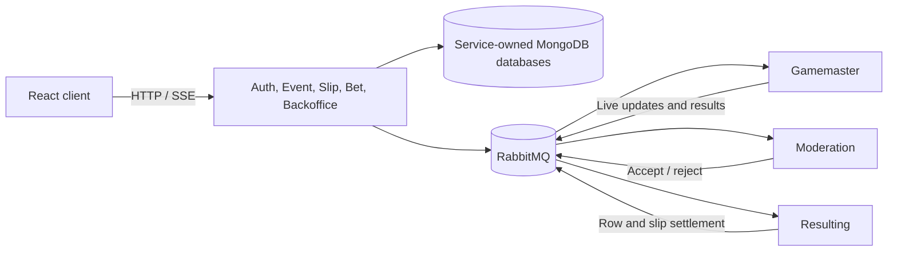

# BetStan

BetStan is a full-stack sportsbook simulation built around scheduled football
events, compressed live matches, pre-match and live betting, moderation,
settlement, betting history, statistics, and a public simulation Backoffice.
It is an engineering and product demonstration; it does not place real-money
bets or consume real match feeds.

[Read the complete BetStan wiki](https://github.com/vasilyevstan/betstan/wiki)

## Product at a glance

- Events are created on a schedule or through Backoffice.
- Pre-match 1X2 and Correct Score odds come from one coherent expected-goals
  and Poisson model.
- Gamemaster turns scheduled events into deterministic ten-minute simulated
  matches with goals, cards, corners, free kicks, penalties, and added time.
- Live markets update from the current score, phase, remaining time, and
  simulation factors.
- Live and pre-match selections use visibly separate slips and cannot be mixed
  in one placement.
- Moderation validates current event, market, quote, and selection authority
  before acceptance.
- Resulting settles rows and complete slips, while My Bets exposes the final
  outcome and payout.
- The React client supports three UI variants and dark/light themes.
- Public Backoffice controls synthetic event creation, visibility, and manual
  results with bounded and idempotent operations.

## How it works

BetStan uses nine deployable services. HTTP APIs own browser-facing commands
and projections; internal workers generate matches, moderate placements, and
settle outcomes. Services own their data and exchange durable facts through
RabbitMQ. The Event service streams the current public projection to browsers
over SSE, while persisted state and replay remain the recovery authority.

## Wiki guide

| Topic | What it covers |
| --- | --- |
| [Product overview](https://github.com/vasilyevstan/betstan/wiki/Product-Overview) | Capabilities, journeys, terminology, and product invariants |
| [Application processes](https://github.com/vasilyevstan/betstan/wiki/Application-Processes) | Accounts, sessions, event generation, odds, slips, moderation, settlement, and Backoffice |
| [Architecture](https://github.com/vasilyevstan/betstan/wiki/Architecture) | Service map, ownership, communication, and reliability patterns |
| [Message flows](https://github.com/vasilyevstan/betstan/wiki/Message-Flows) | RabbitMQ topics and end-to-end sequence diagrams |
| [User interface](https://github.com/vasilyevstan/betstan/wiki/User-Interface) | UI variants, light/dark themes, layouts, states, and design principles |
| [Live betting](https://github.com/vasilyevstan/betstan/wiki/Live-Betting-Production) | Match phases, incidents, live markets, history, and production behavior |
| [Security](https://github.com/vasilyevstan/betstan/wiki/Security) | Identity, trust boundaries, betting integrity, and disclosure policy |
| [Infrastructure](https://github.com/vasilyevstan/betstan/wiki/Infrastructure) | Runtime topology, images, persistence, networking, and health |
| [Quality gates](https://github.com/vasilyevstan/betstan/wiki/Quality-Gates) | Tests, coverage, reviews, contracts, and release evidence |
| [Release orchestration](https://github.com/vasilyevstan/betstan/wiki/Release-Orchestration) | Branch flow, exact-SHA builds, deployment, activation, and rollback |
| [Agents](https://github.com/vasilyevstan/betstan/wiki/Agents) | Reusable engineering-agent responsibilities and collaboration model |
| [Engineering learnings](https://github.com/vasilyevstan/betstan/wiki/Engineering-Learnings) | Reliability, compatibility, UX, testing, and delivery lessons |

## Repository map

| Path | Responsibility |
| --- | --- |
| `client/` | React user interface |
| `auth/` | Accounts and login sessions |
| `event/` | Event catalog, pre-match pricing, public live projection, and SSE |
| `slip/` | Live and pre-match draft boards and placement workflow |
| `bet/` | User-visible betting ledger and history |
| `backoffice/` | Public simulation operations |
| `gamemaster/` | Deterministic match simulation and live markets |
| `moderation/` | Placement acceptance authority |
| `resulting/` | Row, slip, and payout settlement |
| `common/src/` | Canonical shared contracts and messaging source |
| `infra/` | Kubernetes, deployment, validation, and operational contracts |
| `docs/wiki/` | Canonical source for the published GitHub wiki |
| `.github/agents/` | Reusable specialist and orchestration agents |

Contribution and local-development conventions are documented in
[CONTRIBUTING.md](CONTRIBUTING.md). Reviewed wiki content is maintained in
`docs/wiki/` and published byte-for-byte to the
[GitHub wiki](https://github.com/vasilyevstan/betstan/wiki).
