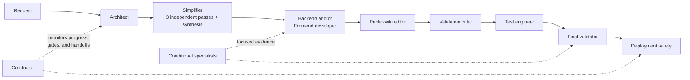

# Agents

## Why BetStan uses agents

BetStan's reusable agents separate design, implementation, review, testing,
and production operations. The goal is independent evidence with clear
ownership, not more participants.

An agent status is never permission to merge or deploy. GitHub branch
protection, exact-SHA checks, protected environments, and the release workflow
remain authoritative.

## Standard workflow

## Universal quality-chain agents

| Agent | Role | Mode |
|---|---|---|
| `betstan-architect` | Converts an accepted request into service boundaries, dependencies, compatibility rules, risks, and acceptance criteria | Read-only |
| `betstan-simplifier` | Challenges overengineering through three independent model-family passes and one bounded synthesis | Read-only |
| `betstan-backend-developer` | Implements bounded TypeScript service, shared-contract, RabbitMQ, MongoDB, migration, and backend-test changes | Repository editor |
| `betstan-frontend-developer` | Implements bounded React, SSE, responsive, accessible, and client-test changes | Repository editor |
| `betstan-public-wiki-editor` | Assesses every exact diff, updates relevant canonical public pages, and prepares byte-identical publication | Documentation editor |
| `betstan-validation-critic` | Adversarially reviews the immutable candidate for concrete bugs, races, regressions, and missing acceptance evidence | Read-only |
| `betstan-test-engineer` | Selects and runs focused, integration, regression, browser, and contract tests | Read-only |
| `betstan-final-validator` | Reconciles requirements and all independent evidence before release review | Read-only |

Backend and frontend developers are implementation owners, not Git actors.
They do not merge, push, approve, or deploy.

## Orchestration

| Agent | Role | Mode |
|---|---|---|
| `betstan-conductor` | Registers work, dependencies, checkpoints, progress signals, protected gates, and handoffs; detects stalls and coordinates bounded recovery | Read-only by default; narrowly governed edits only for a proven self-imposed policy defect |

The conductor distinguishes activity from progress. A running process, growing
log, or watcher is not a deliverable. It checks the underlying job, approval,
agent result, or handoff and assigns one owner for the next action.

The conductor does not duplicate a slow agent, silently reset a deadline, or
weaken a real safety gate. If a repository rule itself creates a proven false
block, the same work unit may correct only that rule and its focused tests
through the normal branch path.

It also treats concurrent feature delivery as normal. A session records the
commits its outcome requires, while the release candidate may contain
additional protected work. The conductor adopts the exact current `master`
only after ancestry and complete-candidate validation, and it keeps live
production mutations serialized.

## Product and engineering specialists

| Agent | Trigger | Role |
|---|---|---|
| `betstan-ux-ui-expert` | Any user-visible or interactive change | Defines the product-wide consistency baseline, accessibility and responsive criteria, then audits the immutable result |
| `betstan-service-contract-reviewer` | HTTP, JWT, message, persistence, or shared-package boundary change | Traces producer, consumer, data, compatibility, and affected-test impact |
| `betstan-quality-gate-reviewer` | CI, coverage, branch protection, or false-green risk | Verifies gates are reproducible, complete, and attached to the intended change |
| `betstan-branch-governance-reviewer` | Branch, PR, ancestry, or exact-SHA question | Verifies allowed source/target flow and trusted status provenance |
| `betstan-auth-security-reviewer` | Authentication, session, identity, or authorization change | Reports high-confidence exploitable auth/security defects without editing |

The UX/UI expert is mandatory for every user-facing change. Other specialists
join only when their trigger applies; they do not become extra universal
handoffs.

## Deployment, runtime, and migration specialists

| Agent | Trigger | Role |
|---|---|---|
| `betstan-deployment-safety` | PR, CI/CD, exact-SHA deployment, rollback, or post-merge work | Owns release safety, provenance, rollback readiness, and deployed-state conclusions |
| `betstan-oci-operator` | Explicitly approved OCI runtime mutation | Diagnoses first and performs only the authorized bounded operation |
| `betstan-oci-health-reviewer` | OCI deployment or health assessment | Independently checks exact provenance, routing, workloads, data, broker, and cost constraints |
| `betstan-domain-ingress` | DNS, TLS, redirect, ingress, or load-balancer change | Protects canonical routing and diagnostic separation |
| `betstan-mongo-migration` | Shared-Mongo migration, cleanup, rollback, or recovery | Preserves journal, lock, topology, and data safety |
| `betstan-migration-recovery` | Interrupted cross-cloud replacement | Recovers the existing migration state rather than starting a competing operation |
| `betstan-aks-operator` | Explicitly approved Azure runtime diagnostics or recovery | Owns bounded AKS operations and restoration evidence |
| `betstan-azure-cost-analyst` | Azure cost or regional optimization question | Produces read-only, evidence-based cost comparisons under runtime constraints |
| `betstan-azure-retirement` | Verified post-migration Azure deletion | Deletes only the exact approved inventory and proves retirement completion |

Mutation-capable runtime agents begin with diagnosis and require exact scope,
authority, rollback, and stop conditions. They do not treat a broad request as
permission for unrelated production changes.

## Handoffs

Each work unit records:

- one stable work ID and owner;
- the bounded objective and out-of-scope area;
- exact base and candidate SHAs;
- dependencies and specialist evidence;
- files or runtime surfaces owned;
- validation performed and not performed;
- unresolved risks;
- checkpoint, recovery action, and stop condition;
- one exact next owner.

Corrections stay in the same logical agent conversation whenever possible.
Starting a replacement agent while the original can still produce side
effects creates contradictory ownership and is prohibited.

## Model diversity

The simplifier gate uses three independent model families with the same input,
then one synthesis. The individual passes challenge scope; they do not vote on
requirements. If a recommendation would remove accepted behavior, safety,
compatibility, observability, or rollback, it is rejected.

Other reviews use model diversity when it adds independent reasoning, but the
repository still assigns one path owner and one final authority for each
decision.

## Agent selection guide

1. Start with the architect for a material feature or cross-service change.
2. Run the simplifier before implementation.
3. Select backend and/or frontend ownership from the affected paths.
4. Run the mandatory public-wiki assessment and update relevant canonical
   pages.
5. Add only specialists whose documented trigger applies.
6. Keep the conductor active for blocking work and protected operations.
7. Run critic, tests, and final validation on the immutable result.
8. Hand release decisions to deployment safety and the matching runtime
   operator.

## Related pages

- [[Quality Gates]]
- [[Release Orchestration]]
- [[UI UX Consistency]]
- [[Engineering Learnings]]
