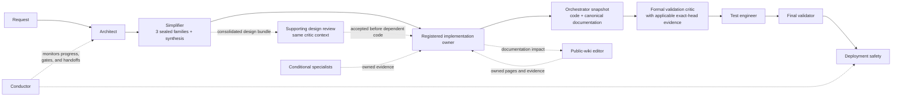

# Agents

## Why BetStan uses agents

BetStan's reusable agents separate design, implementation, review, testing,
and production operations. The goal is independent evidence with clear
ownership, not more participants.

An agent status is never permission to merge or deploy. GitHub branch
protection, exact-SHA checks, protected environments, and the release workflow
remain authoritative.

## Standard workflow

The six universal gates remain architect, simplifier, implementation owner,
formal critic, test engineer, and final validator. Snapshot creation and the
bounded design review are supporting work, not additional universal gates.
Applicable exact-head specialist reviews consume the snapshot before formal
critic review.

## Universal quality-chain agents

| Agent | Role | Mode |
|---|---|---|
| `betstan-architect` | Converts an accepted request into service boundaries, dependencies, compatibility rules, risks, and acceptance criteria | Read-only |
| `betstan-simplifier` | Challenges overengineering through three independent model-family passes and one bounded synthesis | Read-only |
| `betstan-backend-developer` | Implements bounded TypeScript service, shared-contract, RabbitMQ, MongoDB, migration, and backend-test changes | Repository editor |
| `betstan-frontend-developer` | Implements bounded React, SSE, responsive, accessible, and client-test changes | Repository editor |
| `betstan-validation-critic` | Reviews a consolidated design bundle, then the immutable candidate for concrete bugs, races, regressions, and missing acceptance evidence | Read-only |
| `betstan-test-engineer` | Selects and runs focused, integration, regression, browser, and contract tests | Read-only |
| `betstan-final-validator` | Reconciles requirements and all independent evidence before release review | Read-only |

Backend and frontend developers share the developer gate for application
paths. Infrastructure/runtime specialists or the authorized human/orchestrator
own that gate for their infrastructure or governance paths. The public-wiki
editor owns canonical documentation and returns supporting output to the
registered implementation owner.

File-editing developers are not Git actors. They do not merge, push, approve,
or deploy; the authorized orchestrator creates the complete immutable
candidate.

## Orchestration

| Agent | Role | Mode |
|---|---|---|
| `betstan-conductor` | Registers work, dependencies, checkpoints, progress signals, protected gates, and handoffs; detects stalls and coordinates bounded recovery | Read-only by default; narrowly governed edits only for a proven self-imposed policy defect |

The conductor distinguishes activity from progress. A running process, growing
log, or watcher is not a deliverable. It checks the underlying job, approval,
agent result, or handoff and assigns one owner for the next action.

Routine scope, routing, receipt acknowledgements, and timers belong to the
conductor, not a critic queue. It returns obvious scope violations to their
native owner and consults the retained critic only for substantive ambiguity.
Missing advisory work blocks only its affected dependants: independently
authorized observation, eligible approval, safe completion, and incident
recovery continue. Missing required technical evidence still blocks the
operation that needs it. The conductor routes eligible approvals to the
authorized orchestrator; it does not submit approvals itself.

The conductor does not duplicate a slow agent, silently reset a deadline, or
weaken a real safety gate. If a repository rule itself creates a proven false
block, the same work unit may correct only that rule and its focused tests
through the normal branch path.

At the existing 15-minute no-progress investigation checkpoint, report the
bounded result or concrete blocker and smallest safe next action. Repeated
plans, hypotheses, tool calls, or status updates alone are not progress. This
checkpoint does not shorten a genuine provider wait or waive a safeguard.
Once a slice is accepted, keep its feature/design scope fixed during release;
continue required safety work and only the smallest correction for an
observed blocker. See [[Release Orchestration]] for owned operational waits.

It also treats concurrent feature delivery as normal. A session records the
commits its outcome requires, while the release candidate may contain
additional protected work. The conductor adopts the exact current `master`
only after ancestry and complete-candidate validation, and it keeps live
production mutations serialized.

## Product and engineering specialists

| Agent | Trigger | Role |
|---|---|---|
| `betstan-public-wiki-editor` | Public documentation impact is plausible or ambiguous | Returns the smallest relevant canonical page update and evidence; requires authorized post-merge publication but does not publish |
| `betstan-ux-ui-expert` | Any user-visible or interactive change | Defines the product-wide consistency baseline, accessibility and responsive criteria, then audits the immutable result |
| `betstan-service-contract-reviewer` | HTTP, JWT, message, persistence, or shared-package boundary change | Traces producer, consumer, data, compatibility, and affected-test impact |
| `betstan-quality-gate-reviewer` | CI, coverage, branch protection, or false-green risk | Verifies gates are reproducible, complete, and attached to the intended change |
| `betstan-branch-governance-reviewer` | Branch, PR, ancestry, or exact-SHA question | Verifies allowed source/target flow and trusted status provenance |
| `betstan-auth-security-reviewer` | Authentication, session, identity, or authorization change | Reports high-confidence exploitable auth/security defects without editing |

The UX/UI expert is mandatory for every user-facing change. Other specialists
join only when their trigger applies; they do not become extra universal
handoffs.

## Deployment, runtime, and migration specialists

| Agent | Trigger | Role |
|---|---|---|
| `betstan-deployment-safety` | PR, CI/CD, exact-SHA deployment, rollback, or post-merge work | Owns release safety, provenance, rollback readiness, and deployed-state conclusions |
| `betstan-oci-operator` | OCI-owned repository work or explicitly approved runtime operation | Edits only owned source for repository work; diagnoses runtime work first and performs only the authorized bounded operation |
| `betstan-oci-health-reviewer` | OCI deployment or health assessment | Independently checks exact provenance, routing, workloads, data, broker, and cost constraints |
| `betstan-domain-ingress` | DNS, TLS, redirect, ingress, or load-balancer change | Protects canonical routing and diagnostic separation |
| `betstan-mongo-migration` | Shared-Mongo migration, cleanup, rollback, or recovery | Preserves journal, lock, topology, and data safety |
| `betstan-migration-recovery` | Interrupted cross-cloud replacement | Recovers the existing migration state rather than starting a competing operation |
| `betstan-aks-operator` | Explicitly approved Azure runtime diagnostics or recovery | Owns bounded AKS operations and restoration evidence |
| `betstan-azure-cost-analyst` | Azure cost or regional optimization question | Produces read-only, evidence-based cost comparisons under runtime constraints |
| `betstan-azure-retirement` | Verified post-migration Azure deletion | Deletes only the exact approved inventory and proves retirement completion |

Mutation-capable runtime agents begin with diagnosis and require exact scope,
authority, rollback, and stop conditions. They do not treat a broad request as
permission for unrelated production changes.

Seven specialists retain manual-only invocation: AKS operator, Azure
retirement, domain/ingress, migration recovery, Mongo migration, OCI health
reviewer, and OCI operator. Model routing must not invoke them automatically;
manual invocation itself is not runtime authorization.

Repository-only work reports its source changes and local validation, not a
live health conclusion, and does not require unrelated provider operations.
Runtime work retains all checks for its selected runtime and procedure: AKS
topology-journal requirements are not OCI release prerequisites, and k3s
identity validation does not require an OKE configuration. In-runtime Mongo
consolidation and cross-cloud migration retain their own identity, backup,
compatibility, lock/fence, and rollback evidence.

## Handoffs

Each work unit records:

- the immutable root request, with a distinct stable work ID for each logical
  gate and one owner;
- the bounded objective, acceptance criteria, allowed actions, and exclusions;
- the exact baseline and, for formal review, immutable candidate SHA;
- dependencies and specialist evidence;
- files or runtime surfaces owned;
- validation performed and not performed;
- unresolved risks;
- the original correction budget, monotonic attempt count, checkpoint,
  recovery action, and stop condition;
- one exact next owner.

| Completed output | Direct next owner |
|---|---|
| Architect contract | Three independent simplifier passes, then one synthesis |
| Consolidated design bundle | Supporting design critic, then registered implementation owner |
| Implementation and triggered specialist outputs, including wiki pages | One implementation owner assembling the complete candidate |
| Complete code and canonical documentation | Authorized orchestrator creating the immutable snapshot |
| Snapshot and applicable exact-head specialist evidence | Formal critic, then test engineer, then final validator |
| Final source acceptance | Deployment safety, then the authorized operation owner |
| Terminal operation and applicable publication evidence | Conductor/orchestrator completion |

Route completed work immediately. The recipient's first scoped action
acknowledges receipt before substantive review; receipt is not acceptance.
A missing receipt becomes a stall at its registered acknowledgement deadline,
not instantly, and does not need an acknowledgement-only agent.

Corrections stay in the same logical agent conversation whenever possible.
They preserve that gate's work ID and original budget under the same root
request; a new branch, model, or registration does not reset attempts.
Starting a replacement agent while the original can still produce side
effects creates contradictory ownership and is prohibited.

### Design review and formal code review

For a new or materially changed design, the critic reviews one consolidated
bundle of architecture, all three completed sealed passes, and synthesis
before dependent implementation. `DESIGN_REVIEW_PASSED` accepts only the
design bound to its baseline and artifact; it is not `APPROVE_SLICE`, test
success, or release authority. The critic does not review individual sealed
passes, reveal their reasoning to one another, or redo synthesis.

Reuse the same critic context for the formal immutable code-and-documentation
review. The implementation owner assembles the candidate; the authorized
orchestrator creates its snapshot. Exact-head UX and other applicable source
reviews consume that snapshot before formal critic review. Source corrections
require a new snapshot and revalidation of affected evidence. Native
specialist statuses remain scoped evidence, not a complete developer-gate
handoff.

Further critic work requires changed substantive evidence, an unresolved
finding, or a concrete scope risk. Routine reports, status, acknowledgements,
timers, approvals, and unchanged artifacts do not trigger another round.
Findings name a concrete mismatch, consequence, and smallest correction, not
an optional redesign. The conductor checks critic scope and timeliness; the
final validator independently checks critic and test evidence and does not
return its verdict for critic approval. There is no recursive reviewer chain.

### Supporting test evidence

An implementation or test owner may supply narrowly scoped, source-bound
rendered measurements to UX before the formal test gate. A test engineer's
`SUPPORTING_EVIDENCE_READY` result belongs only to that supporting task: it
does not require its own future UX or critic verdict, cannot emit
`TESTS_GREEN`, and cannot satisfy the formal test gate. The requesting
specialist consumes the measurements and returns its own evidence to the
implementation owner.

Reuse verified immutable facts only with current scope and complete coverage
as required by [[Quality Gates]]. Keep private handoff references out of the
public handbook; see [[Security]].

### Resuming accepted reviews

The canonical reuse policy is **Reusing accepted evidence** in
[the agent-team README](https://github.com/vasilyevstan/betstan/blob/master/.github/agents/README.md).
A crash, pause, compaction, new PR, promotion, or ancestry synchronization
alone does not invalidate a completed source review. Recover its original
SHA, base, scope, criteria, report, verdict, and required model metadata;
missing evidence must not be invented or relabelled as a new-head review.

Reuse requires proof that the relevant inputs, dependencies, criteria, and
current policy remain unchanged. Reopen only invalidated gates and their
dependants, keeping the same owner context when available. Required
exact-current-SHA CI, merge-snapshot checks, runtime acceptance, provenance,
and approval controls remain current. Record the justification in the
existing handoff, not a new ledger.

## Model diversity

The simplifier gate uses three independent model families with the same input,
then one synthesis. The individual passes challenge scope; they do not vote on
requirements. If a recommendation would remove accepted behavior, safety,
compatibility, observability, or rollback, it is rejected.

Other reviews use model diversity when it adds independent reasoning, but the
repository still assigns one path owner and one final authority for each
decision.

## Agent selection guide

1. Start with the architect for a material feature or cross-service change.
2. Complete the three sealed simplifier passes and synthesis; obtain the
   consolidated design review before implementing a new or materially changed
   design.
3. Select the registered implementation owner by affected paths and edit
   authority, including infrastructure and governance work.
4. Record documentation impact; invoke the public-wiki editor only when impact
   is plausible or ambiguous.
5. Add only specialists whose documented trigger applies.
6. Keep the conductor active for blocking work and protected operations.
7. Assemble code and documentation, obtain the orchestrator's immutable
   snapshot and applicable exact-head specialist results, then run formal
   critic, tests, and final validation.
8. Hand release decisions to deployment safety and the matching runtime
   operator.

## Related pages

- [[Quality Gates]]
- [[Release Orchestration]]
- [[Security]]
- [[UI UX Consistency]]
- [[Engineering Learnings]]
