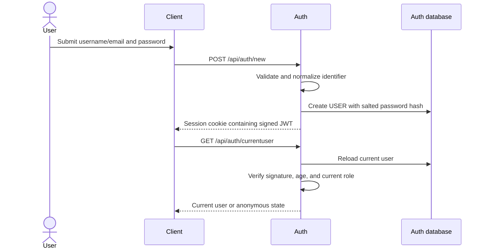
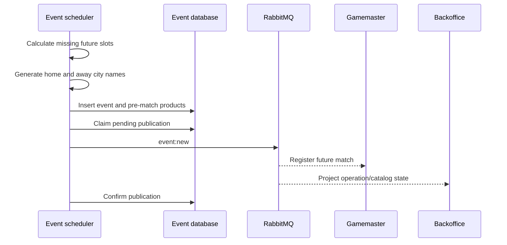
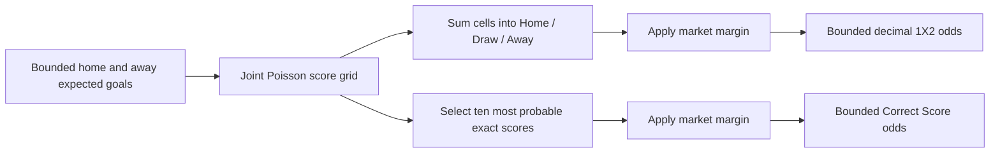
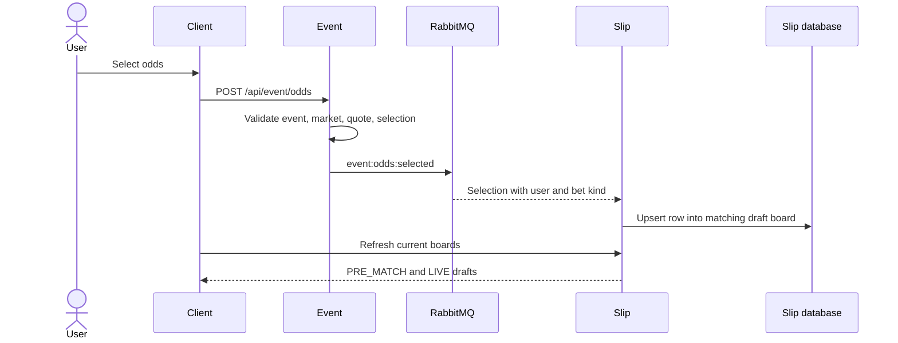
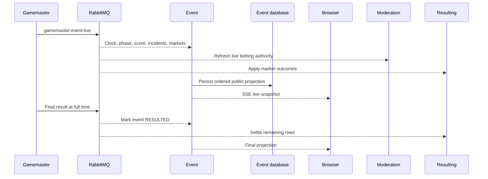

# Application Processes

BetStan is a message-driven betting simulation. A user action may begin as an
HTTP request, but durable state changes are coordinated through service-owned
databases and RabbitMQ events. This page follows the main application
processes from account creation through match settlement.

For the service map and message catalog, see [[Architecture]] and
[[Message Flows]]. For the live-match state model, see
[[Live Betting Production]].

## Responsibility map

| Process | Primary owner | Supporting services |
| --- | --- | --- |
| Account creation and login | Auth | Client |
| Scheduled event creation | Event | Gamemaster, Backoffice |
| Manual event creation and control | Backoffice | Event, Gamemaster |
| Pre-match product generation | Event | Client |
| Live simulation and pricing | Gamemaster | Event, Moderation, Resulting |
| Draft slip maintenance | Slip | Event, Client |
| Placement and moderation | Slip, Moderation | Bet, Resulting |
| Settlement and payout | Resulting | Bet, Event, Gamemaster |
| Public event projection | Event | Client |

## User creation and login sessions

### Creating an account

1. The signup form accepts either a username or an email address in the same
   identifier field and validates the password before sending the request.
2. Auth trims and normalizes the identifier for case-insensitive uniqueness.
3. The password is never stored directly. A random salt and `scrypt` produce
   the persisted hash.
4. New accounts receive the ordinary `USER` role.
5. Auth immediately issues the same session used by login, so a successful
   signup signs the user in.

### Keeping a session active

The signed JWT is stored in the application's cookie-backed session and is
sent automatically with subsequent browser requests. The token contains the
user ID, public identifier, role, issue time, and a 12-hour expiry.

On application load and after login or logout, the Client calls
`/api/auth/currentuser`. Auth does not trust the cookie alone: it reloads the
persisted user and clears the session if the user no longer exists, the signed
timestamp is stale, or the persisted role differs from the role in the token.
Logout explicitly clears the session. This keeps normal navigation and page
reloads signed in while ensuring that account and role changes take effect.

## Event creation

Events can enter the system from the scheduler or from the public Backoffice.
Both paths persist intent before relying on message delivery.

### Scheduled events

The scheduler maintains a configurable pool of future start slots. Slot
identity is deterministic, so retries do not create a second logical event.
For a newly inserted slot, two independently generated Faker city names become
the home and away teams. `EventTemplate` then builds the public event name,
start time, and pre-match products once.

Publication uses persisted claim and confirmation state. If a publish attempt
fails, the stored event remains eligible for replay rather than disappearing.

### Event projection retention

Event keeps its normal catalog tidy without a separate cron workload. When an
accepted pre-match handoff retires the previously completed live event, the
same code path removes Event-service projections whose kickoff is more than
seven days old and which are already resulted or offline.

Future/current events and an anomalous old event that is still online and
unresulted are preserved for investigation. Cleanup failure is propagated so
message redelivery retries it; it is not treated as a successful silent
cleanup. This policy applies to the Event read-model database only. Other
services retain their own data according to their domain responsibilities.

### Backoffice-created events

The Backoffice form accepts bounded home-team and away-team inputs. The server
schedules the event 15 minutes after creation, normalizes the team names,
creates a durable operation with a stable request identity, persists the
event, and publishes `event:new`. Repeating the same accepted request returns
the same operation instead of creating duplicate matches. The API retains a
bounded explicit-delay option for controlled automated validation.

Backoffice-created and scheduled events use the same downstream registration,
simulation, projection, and settlement paths. The origin changes; the betting
model does not.

### How team names are selected

| Creation path | Team-name source |
| --- | --- |
| Scheduler | Two independently generated city names |
| Backoffice | Trimmed, length-bounded operator input |
| Existing event | Persisted names are retained |

Team names are display identity, not a hidden source of strength. New
pre-match expected-goal values and live team profiles are sampled from bounded
models. They are not looked up from a real football-club database.

## Pre-match odds calculation

Each event is priced from one coherent expected-goals model rather than
generating independent random numbers for every button.

1. A bounded expected-goals value is chosen for each team.
2. A normalized joint Poisson grid estimates the probability of each plausible
   home/away scoreline.
3. Home win, draw, and away win probabilities are sums over that same grid.
4. Correct Score selects the ten highest-probability scorelines from the grid.
5. A configured bookmaker margin is applied within each market.
6. Adjusted probabilities are inverted, rounded, and constrained to supported
   decimal-odds bounds.

Because 1X2 and Correct Score come from the same score distribution, their
prices remain numerically related. Correct Score selections are presented in
stable numeric score order, but the selection IDs and prices remain attached
to their original scorelines.

Prices are generated when an event is created, not randomly regenerated on
every read. Compatibility logic can derive deterministic expected goals from
an existing event ID when older stored data needs product completion.

## Live simulation and live odds

Gamemaster registers every `event:new` message and keeps deterministic
simulation state for that event. A seed, simulation version, configuration,
and persisted progress allow the same match to resume without inventing a
different history after a restart.

The simulated football clock covers two halves and added time in a compressed
real-time window. Incident rates are sampled over the football timeline for
goals, cards, corner kicks, notable free kicks, throw-ins, goal kicks, and
penalties. A single match may be quiet; realism is evaluated across many
deterministic simulations rather than by forcing every incident type into
every match.

Live prices are recalculated from current match authority:

- remaining simulated football time;
- configured incident rates;
- sampled home/away attack and discipline factors;
- the current score and phase;
- whether a market is active, suspended, closed, or settled;
- the configured margin and minimum/maximum odds.

Next-card, Next Corner Kick, Next Free Kick, Next Throw-In, Next Goal Kick,
and Next Penalty markets estimate whether another incident will occur before
full time and which side is more likely to receive it. Four next-incident
products rotate alongside Half Time Result and Second Half Score during the
first half; after Second Half Score closes at the second-half kickoff, up to
six next-incident products occupy the visible rotation. Half-time-result
pricing projects remaining first-half goals from the current score. Second
Half Score prices ten exact outcomes and settles at full-time from the score
delta after half-time. Kickoff Team and Goal in First Minute are offered only
in their pre-kickoff window.

Every changed quote receives a new quote version. Lifecycle changes use market
versions. These identities let Event and Moderation reject a price that has
moved, expired, closed, or been superseded.

## Selecting odds and building a draft slip

Event is the first authority check. For pre-match selections it verifies the
stored event, product, and odds identity. For live selections it additionally
checks phase, market status, market and quote versions, quote expiry, and the
selection inside the current market.

Slip ignores selections without a signed-in user. For an authenticated user it
upserts the selection into the draft whose kind matches the selection:
`PRE_MATCH` or `LIVE`. The two boards are independent and may be open at the
same time. A row keeps the original event, market/product, selection, quote,
price, and authority metadata needed for later validation.

Repeated delivery updates the same logical row instead of appending duplicate
selections. Removing a row or clearing a board changes only that draft.

## Submitting a slip

1. The user enters the wager on one draft board and selects **Place bet**.
2. Client sends the board kind, slip identity, current revision, content
   fingerprint, wager, and placement-attempt identity.
3. Slip verifies ownership, kind, supported wager, revision, and fingerprint.
   Stale browser state cannot silently submit a different board.
4. Slip atomically changes the draft into a pending placement and persists the
   publication state.
5. Slip publishes `slip:bet`. A retry with the same attempt identity reuses
   the existing placement instead of charging or creating a second bet.
6. Bet creates the user-facing betting ledger entry, while Resulting registers
   the rows it may later settle.

The board remains visibly live or pre-match throughout the process. Mixed-kind
rows are not accepted merely because a client labels the request as one kind.

## Moderation

Moderation is the acceptance authority for a submitted placement. It checks
the persisted facts available at placement time, including:

- every row has the same bet kind as the slip;
- no live and pre-match selections are mixed;
- event visibility, phase, and final-result state;
- product, market, and selection identity;
- current market status;
- market and quote versions;
- quote validity and expiry;
- whether historical authority is sufficient to make a safe decision.

It publishes `moderation:result` with an accepted or rejected decision and
reason. Slip applies the decision to placement state, Bet applies it to the
user-visible record, and Resulting activates or rejects its settlement state.
All three consumers use idempotent processing so redelivery cannot apply the
same decision twice.

## Resulting and settlement

Resulting tracks accepted rows until the authoritative outcome is known.

- Pre-match 1X2 and Correct Score rows settle from the final event score.
- Live incident markets settle when Gamemaster publishes the corresponding
  market outcome.
- Unreachable or explicitly closed outcomes can be voided according to the
  market result.
- A slip reaches its final state only after all of its rows are terminal.

Resulting publishes row-level and slip-level settlement messages. Bet records
the final row outcomes, aggregate result, and payout in the history shown on
**My Bets**. Delivery ledgers, parked updates, and replay workers handle
duplicates and the case where a settlement message reaches a consumer before
the related placement is visible there.

## Live event propagation

Before kickoff, Gamemaster announces the next live event and publishes the
countdown-market projection. During play it advances the compressed clock and
publishes every authoritative phase, score, incident, and market transition.

Event stores an ordered public read model and fans it out over
server-sent events (SSE). SSE improves latency but is not the durable source of
truth: browser reconnects and terminal updates reconcile through the REST
projection. Moderation consumes the same live authority for placement checks,
and Resulting consumes market settlements.

At full time, the score is the result of the generated goal and penalty
transitions. Gamemaster publishes the terminal live snapshot and final result.
Event closes the event, Resulting settles remaining rows and slips, Bet updates
history, and Backoffice/Gamemaster reconcile the completed operation.

## Backoffice responsibilities

Backoffice is intentionally available to anonymous visitors and signed-in
users. It is the public control surface for the simulation, not a hidden
administrator-only screen.

Its current responsibilities are:

- list event catalog and durable operation state;
- show each event's scheduled kickoff time;
- create a bounded synthetic event;
- request an explicit online or offline visibility target;
- publish a final score once;
- expose pending, failed, and completed operation feedback;
- replay durable pending publications after transient failures.

The service uses no-store responses, bounded validation, atomic one-time result
settlement, idempotent visibility targets, explicit public serialization, and
persisted publication state. RabbitMQ delivery completes propagation, but the
accepted operation remains recoverable if delivery is interrupted.

An administrator-only scope still exists for explicitly named offline
acceptance events used during controlled validation. That narrow capability
does not gate the normal Backoffice catalog or controls.

## Cross-process invariants

- A service owns its database; consumers do not reach into another service's
  collections.
- Important state is persisted before message delivery is treated as
  successful.
- Message handlers expect duplicate and out-of-order delivery.
- Selection and quote IDs, not visible ordering, preserve betting identity.
- Live and pre-match rows remain separate from draft through history.
- SSE is a projection channel, not the settlement authority.
- Existing rows remain readable when additive fields are absent.
