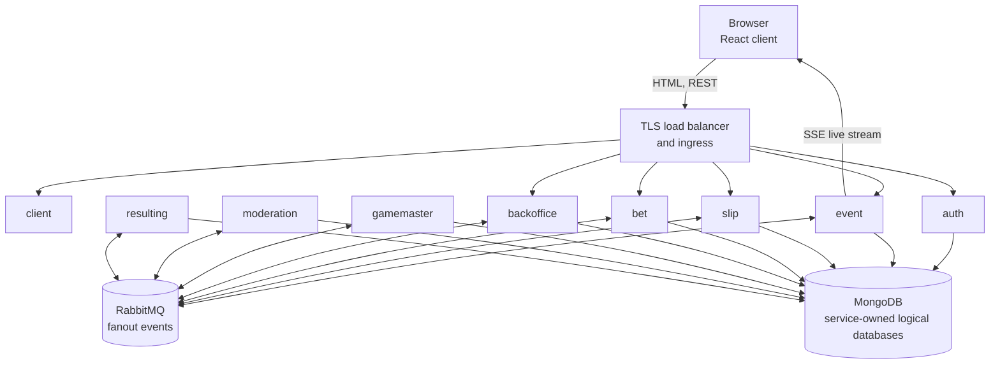
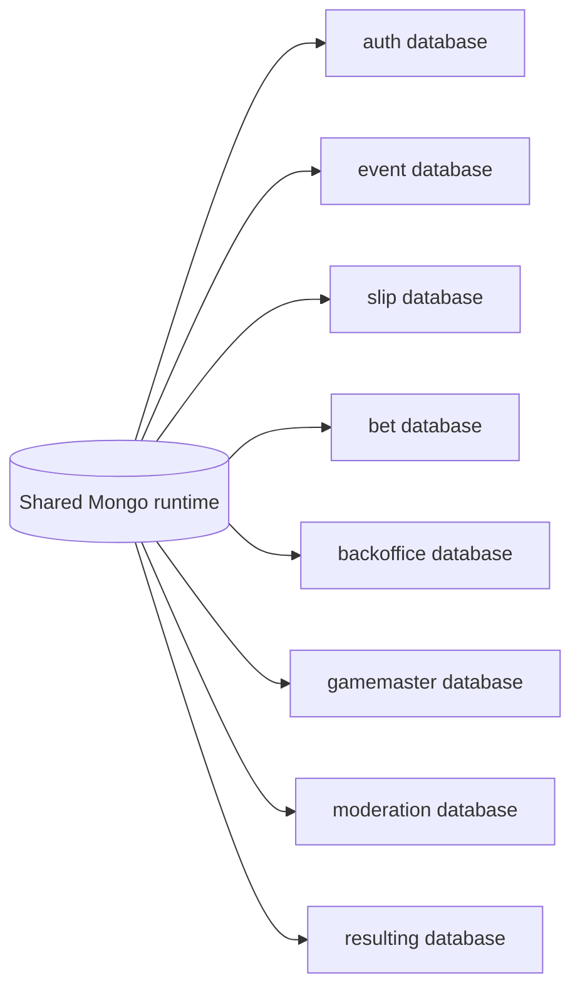

# Architecture

## Architectural style

BetStan is a TypeScript and JavaScript microservice system with:

- a React single-page application;
- six HTTP-facing application services;
- three internal event-driven workers;
- RabbitMQ fanout messaging;
- one persistent MongoDB runtime with a separate logical database per backend
  service;
- a versioned `@betstan/common` package for shared wire contracts,
  middleware, errors, and message infrastructure.

Services own their persistence and behavior. Other services integrate through
HTTP or versioned events rather than reading another service's collections.
The only cross-database reads are bounded, offline maintenance checks executed
with application writers quiesced and the shared database operation lock held.

## Component diagram

## Service catalog

| Service | Interface | Responsibility | Owned data |
|---|---|---|---|
| `client` | HTTP | React UI, navigation, event cards, betting boards, My Bets, statistics, and Backoffice | Browser/session state only |
| `auth` | HTTP | Signup, login, logout, current-user resolution, password verification, session issuance, and authoritative role verification | Users and login-attempt records |
| `event` | HTTP, SSE, AMQP | Scheduled event catalog, public read model, odds selection, live projection, and live-stream fanout | Event catalog and live projection |
| `slip` | HTTP, AMQP | Independent live/pre-match draft boards, placement concurrency, and reliable submission publication | Draft/submitted slips and publication state |
| `bet` | HTTP, AMQP | User-visible bet ledger, moderation state, row/final result, payout data, and statistics | Bets, conflicts, and pending updates |
| `backoffice` | HTTP, AMQP | Public event creation, visibility, manual result controls, and durable publication replay | Operational event records and publication markers |
| `gamemaster` | AMQP worker | Deterministic accelerated football simulation, incidents, score, quotes, market versions, and final result | Simulation state and completed archives |
| `moderation` | AMQP worker | Slip, phase, market, quote, and mixed-kind validation | Mirrored authority, parked requests, and moderation records |
| `resulting` | AMQP worker | Pre-match and live row settlement, final slip result, retries, and replay | Settlement ledgers, archives, and retry state |

## Data ownership

The production runtime uses one persistent MongoDB instance for operational
efficiency, but each backend service has its own logical database and schemas.
The shared physical server is not shared ownership.

This boundary supports:

- independent schemas and indexes;
- service-local migrations;
- message-based consistency between domains;
- compatibility testing during rolling deployment;
- recovery without cross-service collection access.

## Synchronous and asynchronous boundaries

### Synchronous HTTP

HTTP is used for browser-facing commands and queries:

- authentication and current-user lookup;
- event catalog, odds selection, and SSE connection;
- slip query and submission;
- bet history and statistics;
- public Backoffice commands.

The Event service also performs a bounded internal Auth verification when an
administrator requests access to explicitly scoped offline acceptance data.

### Asynchronous RabbitMQ

RabbitMQ carries domain facts such as:

- an event was created or had visibility changed;
- odds were selected;
- a slip was submitted;
- moderation accepted or rejected a slip;
- a live match advanced;
- an event reached a final result;
- a row or complete slip was settled.

Delivery is treated as at-least-once. Consumers therefore use idempotent
writes, monotonic versions or sequences, durable pending records, and replay
workers rather than assuming one delivery in perfect order.

### Server-Sent Events

The Event service exposes live updates to connected browsers through SSE. The
stream is a low-latency projection, not the durable source of truth. Clients
reconcile important terminal state through the authoritative REST read model.

## Shared contract package

`common/src/` is the canonical source for the next `@betstan/common` release.
Deployable services consume an immutable published package version. Changing a
wire contract therefore requires:

1. additive or explicitly migrated schema design;
2. old/new producer-consumer compatibility analysis;
3. package build and packed-artifact validation;
4. a separate reviewed publication;
5. explicit consumer repinning.

Source appearing in the repository does not silently alter a deployed
service.

## Reliability patterns

- **Outbox/replay:** critical commands persist publication intent before
  broker delivery and replay until confirmed.
- **Idempotency:** stable request and placement identifiers distinguish
  retries from conflicting requests.
- **Versioned authority:** live markets carry market and quote versions plus
  quote validity.
- **Deterministic rotation:** a bounded set of visible next-incident products
  rotates only after authoritative settlement; persisted transitions preserve
  the same market/version sequence after restart.
- **Out-of-order handling:** services park early moderation or settlement
  updates until their parent record exists.
- **Terminal sweeps:** background reconciliation repairs missed final
  publications without duplicating settled outcomes.
- **Bounded Event projection:** the ordinary live handoff also removes
  terminal or offline Event records older than seven days, avoiding a separate
  cleanup scheduler while preserving unresolved active anomalies.
- **Backward-compatible defaults:** historical records missing newer fields
  retain their previous semantics.
- **Guarded one-off cleanup:** fixed-identity maintenance first proves there
  are no betting or settlement dependencies, stores a checksummed recovery
  snapshot behind a Gamemaster tombstone, and uses exact optimistic deletes.

## Related pages

- [[Application Processes]]
- [[Message Flows]]
- [[Infrastructure]]
- [[Security]]
- [[User Interface]]
- [[Engineering Learnings]]
