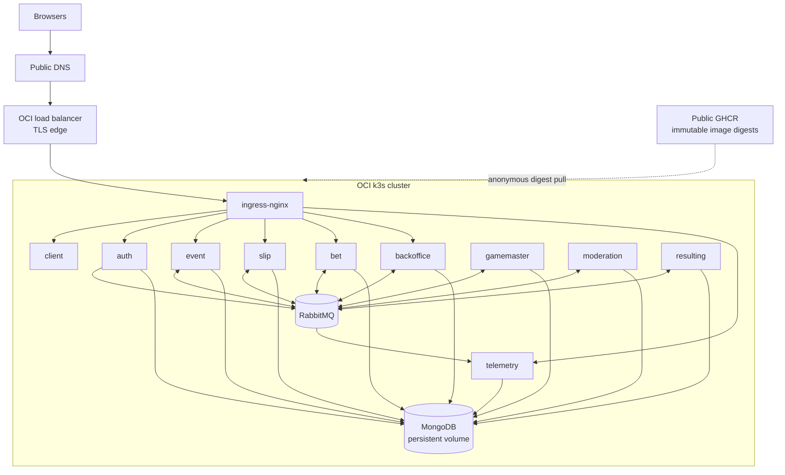

# Infrastructure

## Current production model

BetStan's primary production runtime is an OCI-hosted, cost-constrained
single-node k3s cluster. Public application images are stored in GitHub
Container Registry and deployed by immutable digest.

Azure deployment assets remain in the repository for explicitly approved
recreation, migration history, and recovery work. They are not an automatic
failover path and cannot replace OCI implicitly.

## Deployment topology

## Runtime components

| Layer | Role |
|---|---|
| DNS and certificates | Canonical hostname, permanent redirect from `www`, TLS trust, and a separate diagnostic host |
| Load balancer | Public HTTP/HTTPS entry point |
| Ingress | Routes the SPA and `/api/*` paths; disables buffering for SSE |
| k3s | Runs the ten application workloads plus MongoDB and RabbitMQ |
| MongoDB | Persistent state for nine service-owned logical databases |
| RabbitMQ | Internal fanout broker with 23 current application queues |
| GHCR | Public application image registry; runtime pulls without a long-lived registry secret |
| GitHub Actions | Builds, validates, deploys, activates, rolls back, and records provenance |

MongoDB and RabbitMQ are internal cluster services. Only the load balancer
exposes public ports.

## Persistence and recovery

MongoDB is the durable system of record and uses persistent block storage.
Each backend service owns its logical database and migrations.

RabbitMQ is treated as transport rather than the sole source of truth.
Critical operations persist enough state to retry publication after broker or
process failure. After broker replacement, application consumers recreate
their topology and health validation confirms that queues and consumers have
returned.

Rollback uses a known prior application generation and a baseline captured
before deployment. Data restore is a separate decision and is not coupled to
every application rollback.

### Retained Azure shared-Mongo safety

The retained Azure consolidation path is separate from primary OCI
operations. Its journal and volume reads distinguish validated presence,
explicit Kubernetes `NotFound` for the exact requested resource, and an
unknown result. API errors, empty output, and malformed responses are never
evidence of absence. An uncertain journal read stops migration before data
changes.

Cleanup records completion only after positive absence proof for all seven
persistent volumes in its existing map. Individual reads and per-volume
reclamation waits are bounded; present volumes and transient errors share
the same wait budget, with no extra final probe. Invalid evidence or
exhausted waits fail closed. Partial cleanup preserves its recorded map and
journal state for recovery. The journal format, fixed mapping, locks, and
rollback requirements remain unchanged.

### Bounded k3s root-disk recovery

The infrastructure workflow separates read-only root-filesystem diagnosis from
reclaim. A reclaim must bind the current source, first workflow attempt, exact
infrastructure and image-build evidence, and the preceding diagnosis while
remaining serialized with other protected operations. It may clean either the
package cache or an exact set of repository-owned, unused container images
identified by that diagnosis, never both or an arbitrary image set.

The diagnosis v2 extension adds fixed, read-only MongoDB metadata collection
to governed `diagnose-disk`. It discovers actual databases and collections,
including unknown namespaces, rather than assuming the source inventory is
complete. Reports group application, system, and unattributed storage; database
and collection names outside the exact public allowlist are aliased. Each
collection reports a metadata-derived count, logical data bytes, allocated
data bytes, allocated index bytes, observation timestamps, and MongoDB version.
No records are read or returned, and no caller-supplied query inputs or generic
query interface are accepted.

Collection is bounded to 32 databases and 256 entries, with two-second
command/connection limits (server-side limits where supported), a 30-second
overall metadata-collection budget, a 35-second transport limit, and a 256 KiB
output cap. Storage status is explicit:
`COMPLETE` only when discovery and all required metadata measurements succeed
within those bounds; `PARTIAL` when evidence is incomplete; `UNAVAILABLE` when
no usable Mongo measurement can be established. Unknown metrics are `null`,
never zero. Any Mongo collection or transport failure preserves otherwise
valid disk evidence but cannot establish complete storage measurement.

Views are non-storage namespaces, not empty stored collections. For time
series, a bucket count is explicitly distinguished from a measurement count;
physical bucket storage is counted once, not again under its logical
time-series namespace. Logical bytes must not be added to allocated data/index
bytes. MongoDB figures are neither filesystem usage nor reclaimable bytes and
must not be added to filesystem totals. They support size assessment and
cleanup recommendations, not cleanup authorization.

Existing `k3s-node-disk-diagnosis.v1` evidence remains readable; new
`k3s-node-disk-diagnosis.v2` evidence carries Mongo storage separately from
the unchanged `k3s-node-disk-runtime.v1` snapshot and reclaim authority.
Version 2's scoped identity projection preserves fingerprint comparison
without exposing raw runtime identities. Rollout and rollback must preserve
readers for retained evidence rather than relabeling v2 as v1. This extension
uses the existing governed diagnostics path, adds no workflow or dependency,
and requires no application deployment. It performs no data cleanup, TTL or
index change, or compaction, and its presence is not evidence that a production
measurement has run.

The fixed root-filesystem limit remains 70 percent. Root and persistent-data
mount identities, workload and queue health, public reads, and protected
running, candidate, and rollback image references remain fail-closed.
The validated GHCR generation table is checksum-bound to its summary and
provides immutable source attribution for every exact canonical digest,
including digest-only local cache records when containerd lacks local source
tags. All source aliases contribute protection, so any protected alias
preserves the image, including rollback images after Kubernetes history
garbage collection. Persistent application data, mounted data storage,
unknown, unmapped, cross-service-ambiguous, mixed, foreign, mutable, or pinned
images, and images with live or retained references are not reclaim targets.
Diagnosis remains a conservative inventory; it does not authorize reclamation
or prove future deployment headroom. Explicit exact image IDs require the
reclaim planner's bound evidence and fresh runtime checks, and the presence of
this capability does not prove that it has run or freed space.

Disk health checks support historical pre-Telemetry rollback baselines: only
when a complete, validated workload inventory proves the application Telemetry
Deployment absent may its retained `telemetry:events:v1` queue remain empty
or retain ready backlog without a consumer, provided it has zero consumers and
no unacknowledged or in-flight deliveries. Any other consumerless queue, or a
deployed Telemetry workload missing its queue or consumer, remains unhealthy;
at least one actively consumed queue must remain. Queue parsing still rejects
malformed or duplicate headers and empty output.

## Images and provenance

- Application images are built from the exact `master` SHA.
- Each service image has a source-bound tag for traceability.
- Deployment uses immutable `sha256` digests rather than mutable tags.
- The build and deployment chain verifies the originating workflow, branch,
  source SHA, attempt, and artifact provenance.
- Runtime validation compares expected digests with the image IDs actually
  running in the cluster.
- Registry retention protects the current, candidate, and rollback
  generations before pruning.

## Networking

- The canonical hostname serves the application over HTTPS.
- `www` redirects to the canonical host while preserving the request path.
- A diagnostic hostname is used for infrastructure validation, not product
  identity.
- Ingress routes Auth, Event, Slip, Bet, Backoffice, and the public
  `/api/telemetry` summary separately from the client on canonical and
  diagnostic hosts.
- SSE buffering is disabled so live-event updates reach browsers promptly.
- Database, broker, and cluster-control endpoints are not exposed as public
  application routes.

## Health and observability

Deployment health is broader than "pods are running." The release checks:

- workload readiness and restart changes;
- exact live image digests;
- canonical, redirect, and diagnostic host behavior;
- TLS and ingress routing;
- expected JSON response shapes;
- SSE connectivity;
- MongoDB topology and persistent volume state;
- RabbitMQ topology, consumers, and backlog;
- data-operation locks and maintenance fences;
- browser acceptance and service logs.

The HTTP services expose Kubernetes readiness/liveness checks. Event also has
a bounded five-minute TCP startup budget; after startup, readiness checks run
every five seconds and sustained refusal is restarted in approximately one
minute rather than waiting through a long initial liveness delay. Headless workers are
validated through process health, broker connectivity, queue consumption,
workflow evidence, and end-to-end outcomes.

Runtime diagnostics report each container independently, including restart
count, current and previous state, termination reason, exit code, and
start/finish timestamps. Previous-container logs are requested only when a
restart proves that they may exist, are bounded and redacted, and report
unavailability explicitly. A recovered endpoint or Ready pod does not by
itself explain a prior outage.

## Environment structure

The repository contains:

- local and development manifests for iterative work;
- production-oriented Kubernetes manifests and overlays;
- OCI provisioning, validation, deployment, migration, activation, rollback,
  and recovery scripts;
- retained Azure automation for explicitly approved recovery or recreation.

Runtime selection is explicit and fail-closed. Automation does not silently
switch cloud provider, cluster type, region, paid capacity, or data source.

## Infrastructure constraints

- Production is intentionally cost constrained.
- The runtime does not add paid capacity or an alternate registry as an
  automatic fallback.
- Application rollouts follow the checked-in sequential order, verify each
  workload before continuing, and update the event-producing Gamemaster last.
- Destructive data or infrastructure work requires a dedicated workflow,
  bounded confirmation, a known rollback/recovery state, and post-operation
  validation.

## Related pages

- [[Architecture]]
- [[Security]]
- [[Quality Gates]]
- [[Release Orchestration]]
