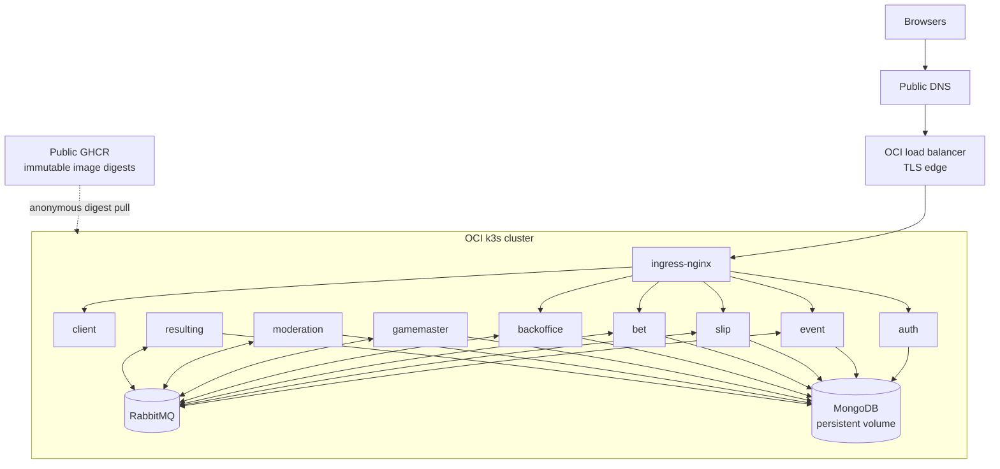

# Infrastructure

## Current production model

BetStan's primary production runtime is an OCI-hosted, cost-constrained
single-node k3s cluster. Public application images are stored in GitHub
Container Registry and deployed by immutable digest.

Azure deployment assets remain in the repository for explicitly approved
recreation, migration history, and recovery work. They are not an automatic
failover path and cannot replace OCI implicitly.

## Deployment topology

## Runtime components

| Layer | Role |
|---|---|
| DNS and certificates | Canonical hostname, permanent redirect from `www`, TLS trust, and a separate diagnostic host |
| Load balancer | Public HTTP/HTTPS entry point |
| Ingress | Routes the SPA and `/api/*` paths; disables buffering for SSE |
| k3s | Runs the nine application workloads plus MongoDB and RabbitMQ |
| MongoDB | Persistent state for eight service-owned logical databases |
| RabbitMQ | Internal fanout broker for domain events |
| GHCR | Public application image registry; runtime pulls without a long-lived registry secret |
| GitHub Actions | Builds, validates, deploys, activates, rolls back, and records provenance |

MongoDB and RabbitMQ are internal cluster services. Only the load balancer
exposes public ports.

## Persistence and recovery

MongoDB is the durable system of record and uses persistent block storage.
Each backend service owns its logical database and migrations.

RabbitMQ is treated as transport rather than the sole source of truth.
Critical operations persist enough state to retry publication after broker or
process failure. After broker replacement, application consumers recreate
their topology and health validation confirms that queues and consumers have
returned.

Rollback uses a known prior application generation and a baseline captured
before deployment. Data restore is a separate decision and is not coupled to
every application rollback.

## Images and provenance

- Application images are built from the exact `master` SHA.
- Each service image has a source-bound tag for traceability.
- Deployment uses immutable `sha256` digests rather than mutable tags.
- The build and deployment chain verifies the originating workflow, branch,
  source SHA, attempt, and artifact provenance.
- Runtime validation compares expected digests with the image IDs actually
  running in the cluster.
- Registry retention protects the current, candidate, and rollback
  generations before pruning.

## Networking

- The canonical hostname serves the application over HTTPS.
- `www` redirects to the canonical host while preserving the request path.
- A diagnostic hostname is used for infrastructure validation, not product
  identity.
- Ingress routes Auth, Event, Slip, Bet, and Backoffice APIs separately from
  the client.
- SSE buffering is disabled so live-event updates reach browsers promptly.
- Database, broker, and cluster-control endpoints are not exposed as public
  application routes.

## Health and observability

Deployment health is broader than "pods are running." The release checks:

- workload readiness and restart changes;
- exact live image digests;
- canonical, redirect, and diagnostic host behavior;
- TLS and ingress routing;
- expected JSON response shapes;
- SSE connectivity;
- MongoDB topology and persistent volume state;
- RabbitMQ topology, consumers, and backlog;
- data-operation locks and maintenance fences;
- browser acceptance and service logs.

The HTTP services expose Kubernetes readiness/liveness checks. Event also has
a bounded five-minute TCP startup budget; after startup, readiness checks run
every five seconds and sustained refusal is restarted in approximately one
minute rather than waiting through a long initial liveness delay. Headless workers are
validated through process health, broker connectivity, queue consumption,
workflow evidence, and end-to-end outcomes.

Runtime diagnostics report each container independently, including restart
count, current and previous state, termination reason, exit code, and
start/finish timestamps. Previous-container logs are requested only when a
restart proves that they may exist, are bounded and redacted, and report
unavailability explicitly. A recovered endpoint or Ready pod does not by
itself explain a prior outage.

## Environment structure

The repository contains:

- local and development manifests for iterative work;
- production-oriented Kubernetes manifests and overlays;
- OCI provisioning, validation, deployment, migration, activation, rollback,
  and recovery scripts;
- retained Azure automation for explicitly approved recovery or recreation.

Runtime selection is explicit and fail-closed. Automation does not silently
switch cloud provider, cluster type, region, paid capacity, or data source.

## Infrastructure constraints

- Production is intentionally cost constrained.
- The runtime does not add paid capacity or an alternate registry as an
  automatic fallback.
- Application rollouts follow the checked-in sequential order, verify each
  workload before continuing, and update the event-producing Gamemaster last.
- Destructive data or infrastructure work requires a dedicated workflow,
  bounded confirmation, a known rollback/recovery state, and post-operation
  validation.

## Related pages

- [[Architecture]]
- [[Security]]
- [[Quality Gates]]
- [[Release Orchestration]]
