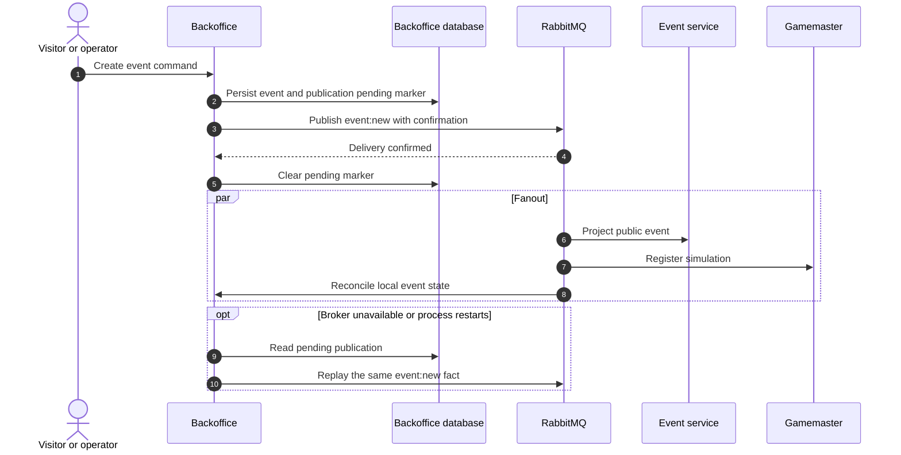
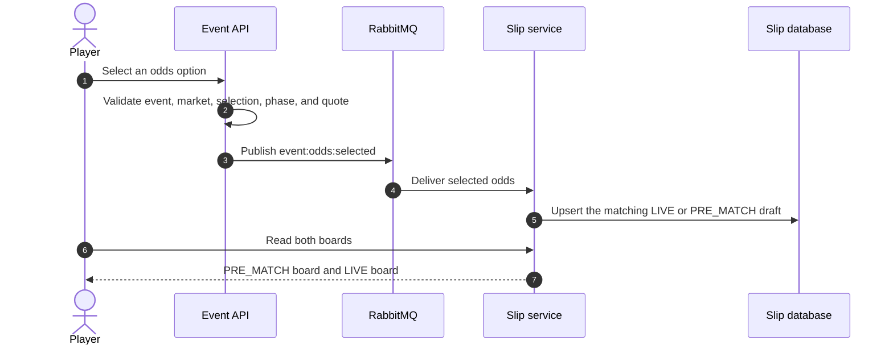
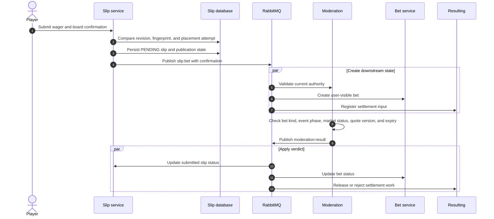
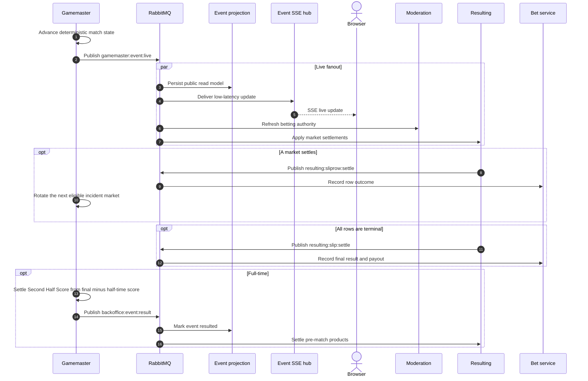
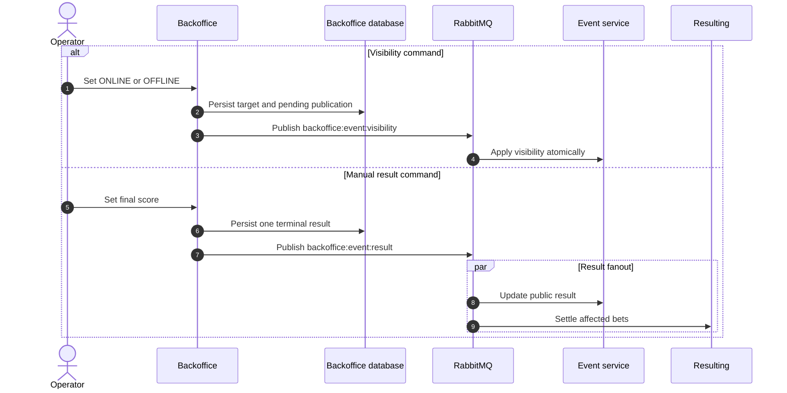

# Message Flows

## Messaging model

BetStan combines browser HTTP, Server-Sent Events, and RabbitMQ fanout events.
RabbitMQ topics represent domain facts, while each consumer owns its queue and
database updates.

For step-by-step product behavior around these exchanges, including user
sessions and odds calculation, see [[Application Processes]].

| Domain fact | Topic | Main publisher | Main consumers |
|---|---|---|---|
| Odds selected | `event:odds:selected` | Event | Slip |
| Slip submitted | `slip:bet` | Slip | Moderation, Resulting, Bet |
| Moderation completed | `moderation:result` | Moderation | Slip, Resulting, Bet |
| Event created | `event:new` | Event or Backoffice | Event, Gamemaster, Backoffice |
| Event result available | `backoffice:event:result` | Gamemaster or Backoffice | Event, Resulting, Moderation, Backoffice, Gamemaster |
| Visibility changed | `backoffice:event:visibility` | Backoffice | Event |
| Live state advanced | `gamemaster:event:live` | Gamemaster | Event, Moderation, Resulting |
| Bet row settled | `resulting:sliprow:settle` | Resulting | Bet |
| Bet settled | `resulting:slip:settle` | Resulting | Bet |

The topic names are stable contracts. Consumer queue names and runtime
instances are implementation details and may evolve independently.

## Event creation and publication

Events can originate from the scheduler or the public Backoffice.

The stable creation request identifier makes an ambiguous client retry
idempotent. A reused identifier with different event content is a conflict,
not a second event.

## Selecting odds and building a board

Anonymous users can browse events. A user identity is required to persist and
submit a personal betting board.

## Wager placement and moderation

Important invariants:

- a single submission contains only live or only pre-match rows;
- a placement attempt is idempotent;
- a changed payload cannot reuse the same attempt as a silent retry;
- moderation uses authoritative current and historical quote state, not the
  browser label;
- early or duplicated messages are parked or ignored safely.

## Live match updates and settlement

The browser stream is intentionally recoverable. Sequence checks reject stale
updates, and terminal state is reconciled against the REST projection so a
missed or reordered stream message does not become final truth.

At most six non-terminal live products are projected into the actionable UI.
The authoritative snapshot retains closed and settled versions so Moderation
can validate an accepted historical quote and Resulting can replay settlement
idempotently. Exact-score products are resolved by selection ID; their shared
neutral side is display metadata, not sufficient settlement identity.

## Visibility and manual result flow

An identical result retry is accepted idempotently. A conflicting second final
score is rejected.

## Delivery and ordering rules

- Publishers confirm broker acceptance for critical mutations.
- A database pending marker remains until confirmation and is replayed after
  restart.
- Consumers acknowledge only after their durable state transition succeeds.
- Duplicate delivery is expected and must be harmless.
- Monotonic sequence, version, and terminal-state guards reject stale updates.
- Out-of-order moderation or settlement is parked until its parent bet exists.
- Message payloads remain backward compatible across a rolling deployment.

## Related pages

- [[Architecture]]
- [[Live Betting Production]]
- [[Security]]
- [[Engineering Learnings]]
