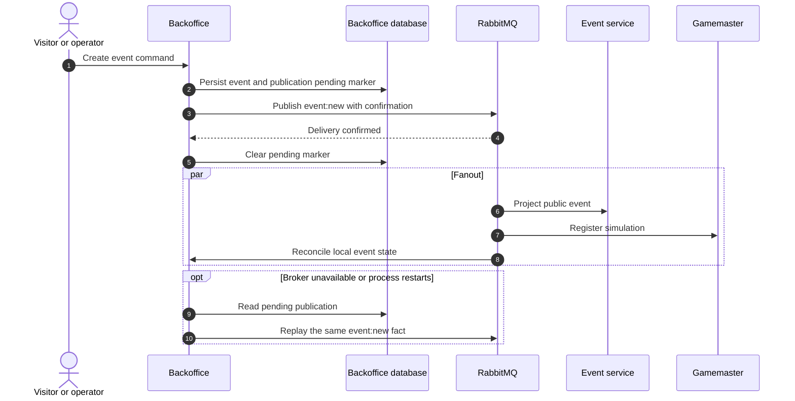
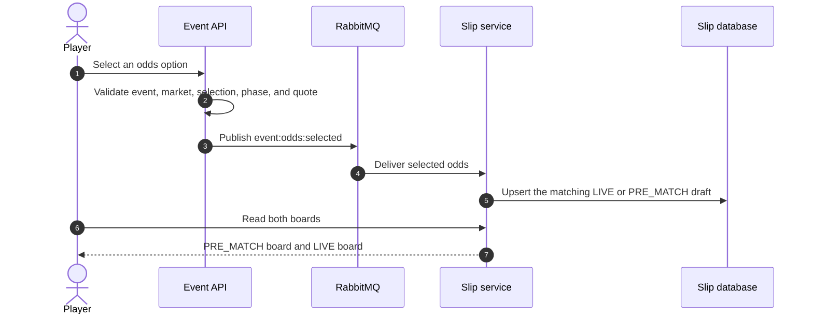
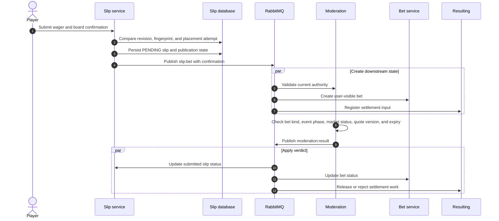
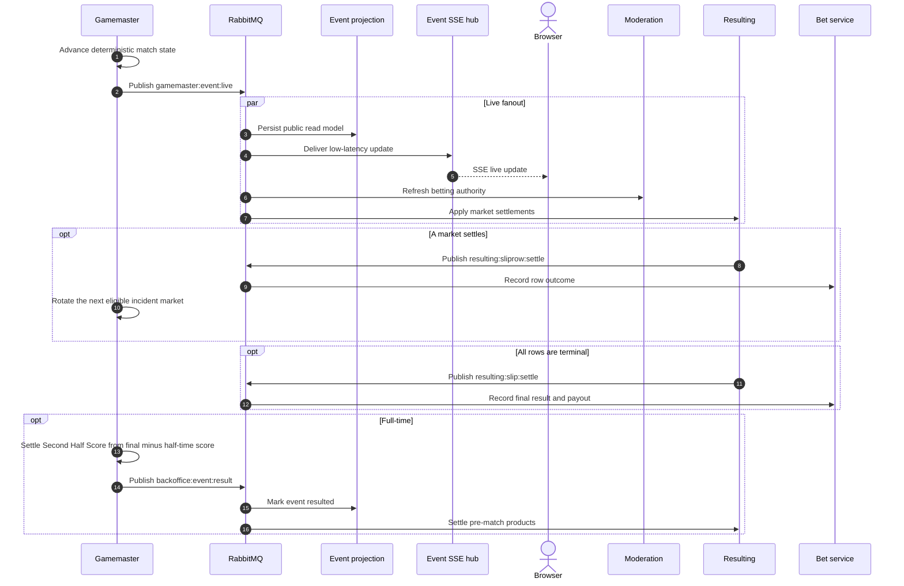
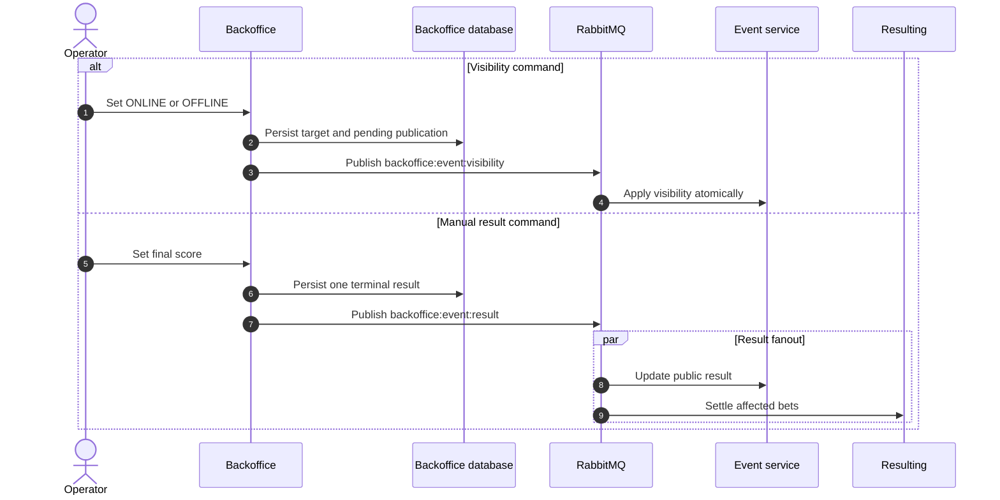
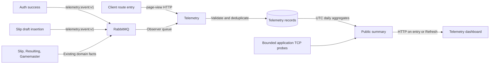

# Message Flows

## Messaging model

BetStan combines browser HTTP, Server-Sent Events, and RabbitMQ fanout events.
RabbitMQ topics represent domain facts, while each consumer owns its queue and
database updates.

For step-by-step product behavior around these exchanges, including user
sessions and odds calculation, see [[Application Processes]].

| Domain fact | Topic | Main publisher | Main consumers |
|---|---|---|---|
| Odds selected | `event:odds:selected` | Event | Slip |
| Slip submitted | `slip:bet` | Slip | Moderation, Resulting, Bet |
| Moderation completed | `moderation:result` | Moderation | Slip, Resulting, Bet |
| Event created | `event:new` | Event or Backoffice | Event, Gamemaster, Backoffice |
| Event result available | `backoffice:event:result` | Gamemaster or Backoffice | Event, Resulting, Moderation, Backoffice, Gamemaster |
| Visibility changed | `backoffice:event:visibility` | Backoffice | Event |
| Live state advanced | `gamemaster:event:live` | Gamemaster | Event, Moderation, Resulting |
| Bet row settled | `resulting:sliprow:settle` | Resulting | Bet |
| Bet settled | `resulting:slip:settle` | Resulting | Bet |
| Operational activity observed | `telemetry:event:v1` | Auth or Slip | Telemetry |

The topic names are stable contracts. Consumer queue names and runtime
instances are implementation details and may evolve independently.
Telemetry also observes `slip:bet`, `resulting:slip:settle`, and
`gamemaster:event:live`; these stable topics are distinct from its
`telemetry:events:v1` consumer queue name.

### Cash-back flow - deployment-gated

The four Common feature topics are wired in source. New cash-back admission
depends on a verified, enabled deployed generation; recovery consumers stay
active with admission off. See [[Release Orchestration]]; source wiring alone
does not establish current production availability.

| Cash-back topic | Publisher -> consumers | Phase |
|---|---|---|
| `bet:cash-back:request` | Bet -> Resulting | Non-reserving `QUOTE`; `CONFIRM` of one stored quote |
| `resulting:cash-back:outcome` | Resulting -> Bet | `QUOTED`, `UNAVAILABLE`, or durable `ACCEPTED` / `REJECTED` receipt |
| `resulting:cash-back:source:request` | Resulting -> Backoffice / Gamemaster | `SNAPSHOT`, `RESERVE`, `RELEASE` |
| `cash-back:source:reply` | Backoffice / Gamemaster -> Resulting | `SNAPSHOT`, `GRANTED`, `RELEASED`, `FENCED`, `DENIED` |

The browser uses Bet's authenticated singular `/cash-back/quote` and
`/cash-back/accept` routes, then operation lookup and bounded receipt history;
the full HTTP contract is in [[Application Processes]]. Resulting has no
business HTTP route and never treats a browser timestamp or a transport
acknowledgement as acceptance.

1. Bet durably records the owned request and publishes `QUOTE`. Resulting
   stores snapshot obligations for both Backoffice and Gamemaster for every
   selected event, grouping selections by event. Snapshots do not reserve.
2. Resulting validates the complete original manifest and current authority,
   computes the offer, and publishes `QUOTED` or `UNAVAILABLE`. Bet stores the
   public offer without exposing internal source proofs.
3. Explicit confirmation names that exact stored quote. Bet persists and
   republishes the same `CONFIRM` until reconciled. Resulting binds one
   `UNDECIDED` Bet slot to the operation, expected revision, quote, manifest,
   and source obligations before sending reservations.
4. Each source atomically grants only against matching authority and an empty
   hold. Backoffice proves lifecycle; Gamemaster proves its own lifecycle and
   exact market/quote identity. Resulting requires every grant and an eligible
   canonical Bet before its exclusive-deadline acceptance.
5. Acceptance, expiry/rejection, and result-first rejection compete for the
   same canonical slot and revision. The winner stores the immutable receipt
   with the financial transition; other workers read that winner. A partial
   leaves the parent active, while a full closure is terminal.
6. Resulting persists receipt history, confirms outcome publication, and
   releases every requested source participant, even if its grant reply was
   lost. Publication and release obligations are replayable. Slot reuse and
   archive wait for their completion; Bet projects the receipt without
   rewinding a newer financial revision.

All four topics use confirmed persistent messages and durable queues.
Consumers acknowledge after their durable handling succeeds. Retries retain
operation/request/decision identity; duplicate and out-of-order delivery does
not create a second closure. No cross-queue ordering is assumed. HTTP `202`
continues to mean durable pending, not a successful decision.

#### Source holds and release

A source snapshot observes an empty hold at generation `b`; a matching
`RESERVE` grants predetermined `b+1`. `RELEASE` binds the original reservation,
participant, operation, both generations, and the canonical terminal decision.
It is constructible from the durable obligation even without a grant reply.
Releasing the matching hold advances to `b+2`; cancellation arriving before
reserve also consumes that target generation, preventing a delayed reserve
from creating an orphan hold.

`RELEASED` concerns only the exact matching hold. `FENCED` proves that the
target generation is consumed, not that a different newer hold is absent or
released. Generation state is retained rather than reset during recovery or
archive. See the [source message contract](https://github.com/vasilyevstan/betstan/blob/master/common/src/event/ICashBackSourceEvent.ts).

Source-authority writers conflict with holds. Gamemaster records its exact
authority-change intent before publication/cursor advancement, preventing a
new grant while a transition's delivery is unresolved. An outstanding hold has
no autonomous TTL, worker-lease expiry, or timeout override: canonical
decision recovery precedes release. A coordinator outage can therefore block
affected source progress. This availability cost is intentional; no browser
timeout or independent history record can release authority.

#### Domain time and replay

Domain times in `data`, including `requestedAt`, `issuedAt` / `expiresAt`,
source `occurredAt`, and grant/receipt `decisionTime`, survive replay
unchanged. The existing publisher refreshes envelope `timestamp` / `sender`;
these cannot replace domain evidence or extend a quote's validity.
`requestedAt` is audit time, not late-acceptance authority; terminal
`decisionTime` denotes database-domain decision time, not physical commit time.
The shared-clock and compatible-writer assumptions are explicit in
[[Architecture]]. An uncertain confirmation still reconciles its original
decision after the browser offer expires; it never silently becomes a new offer.

## Event creation and publication

Events can originate from the scheduler or the public Backoffice.

The stable creation request identifier makes an ambiguous client retry
idempotent. A reused identifier with different event content is a conflict,
not a second event.

## Selecting odds and building a board

Anonymous users can browse events. A user identity is required to persist and
submit a personal betting board.

## Wager placement and moderation

Important invariants:

- a single submission contains only live or only pre-match rows;
- a placement attempt is idempotent;
- a changed payload cannot reuse the same attempt as a silent retry;
- moderation uses authoritative current and historical quote state, not the
  browser label;
- early or duplicated messages are parked or ignored safely.

## Live match updates and settlement

The browser stream is intentionally recoverable. Sequence checks reject stale
updates, and terminal state is reconciled against the REST projection so a
missed or reordered stream message does not become final truth.

At most six non-terminal live products are projected into the actionable UI.
The authoritative snapshot retains closed and settled versions so Moderation
can validate an accepted historical quote and Resulting can replay settlement
idempotently. Exact-score products are resolved by selection ID; their shared
neutral side is display metadata, not sufficient settlement identity.

## Visibility and manual result flow

An identical result retry is accepted idempotently. A conflicting second final
score is rejected.

## Telemetry observation flow

The observer binds only `telemetry:event:v1`, `slip:bet`,
`resulting:slip:settle`, and `gamemaster:event:live`. The generic activity
envelope is restricted to an allowlisted sender and metric, a random event
ID, and matching occurrence/envelope timestamps; it carries no user or slip
identity. Existing business messages still carry their domain data, but
Telemetry reduces them to a metric, hashed deduplication key, and time before
storage.

Submission uses `submittedAt` and complete-slip settlement uses `occurredAt`.
Older messages missing those additive fields fall back to the envelope
timestamp; a present but malformed field is rejected, not silently replaced.
Live updates use their occurrence time and event/sequence identity. Redelivery
therefore retains the first observation rather than counting a second copy or
moving it to a later day.

This queue is durable but the observer is deliberately best-effort. Valid
records are acknowledged after the idempotent write. Invalid messages are
discarded, and a recording failure rejects the observation without requeue.
Diagnostics contain fixed codes, not raw payloads. Auth/Slip activity reports
have no business outbox or replay guarantee; reporter failure cannot undo or
block the successful operation. Telemetry thus permits gaps rather than
imposing its availability on business transactions.

## Business delivery and ordering rules

- Publishers confirm broker acceptance for critical mutations.
- A database pending marker remains until confirmation and is replayed after
  restart.
- Consumers acknowledge only after their durable state transition succeeds.
- Duplicate delivery is expected and must be harmless.
- Monotonic sequence, version, and terminal-state guards reject stale updates.
- Out-of-order moderation or settlement is parked until its parent bet exists.
- Message payloads remain backward compatible across a rolling deployment.

## Related pages

- [[Architecture]]
- [[Live Betting Production]]
- [[Security]]
- [[Engineering Learnings]]
