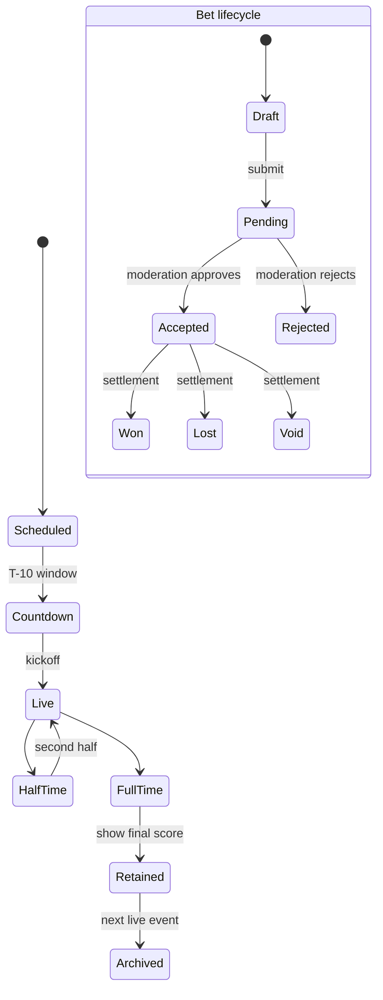

# Product Overview

## What BetStan is

BetStan is a microservice-based sports-betting simulation platform. It creates
scheduled football events, publishes pre-match markets, runs accelerated
ten-minute live matches, accepts selections into separate betting slips,
moderates submitted slips, settles results, and presents bet history and
statistics.

The repository implements simulated wagering and settlement. It does not
contain a deposit, withdrawal, card-payment, or external-wallet integration.

## Main product capabilities

| Capability | User-visible behavior |
|---|---|
| Event catalog | Upcoming fixtures show kickoff time, teams, 1X2, and Correct Score markets. |
| Live football | A scheduled event moves into a live area and progresses through two halves, stoppage time, realistic restart incidents, a rotating maximum-six product set, and full-time. |
| Countdown markets | Ten minutes before kickoff, the next event exposes a countdown and the Kickoff Team and Goal in First Minute products. |
| Betting slips | Signed-in users can keep independent `PRE_MATCH` and `LIVE` slips open at the same time. A submitted slip can contain only one kind. |
| Moderation | Every submitted slip is checked against current event phase, market status, selection identity, quote version, and quote lifetime. |
| Settlement | Pre-match and live rows are settled from authoritative match and market outcomes, then rolled up into the final bet result. |
| Bet history | My Bets distinguishes live from pre-match bets and shows moderation and settlement outcomes without exposing internal identifiers. |
| Statistics | Public aggregate statistics provide a privacy-limited leaderboard view. |
| Backoffice | The event catalog and bounded create, visibility, and result controls are intentionally public in the current product. |
| Responsive UI | The client supports three layout variants, light/dark themes, keyboard access, and desktop/tablet/mobile layouts. |

## User journeys

### Visitor

A visitor can:

1. Browse upcoming, countdown, live, and recently finished events.
2. Watch live scores, incidents, and markets update over Server-Sent Events.
3. Open the public Backoffice and use its bounded event controls.
4. Sign up or sign in before submitting a wager.

### Signed-in player

A player can:

1. Select pre-match or live odds.
2. Maintain both betting slips independently.
3. Submit a wager from one slip.
4. See whether moderation accepted or rejected it.
5. Follow row-level and final settlement in My Bets.
6. Review public betting statistics.

### Administrator

The current Backoffice product is public and does not require the
administrator role. The role remains relevant for tightly scoped operational
acceptance behavior, such as viewing an explicitly named offline synthetic
event during validation. That privileged path is server-verified and is not a
general customer feature.

## Event and bet lifecycle

## Product invariants

- Live and pre-match selections never share one submitted slip.
- Selection identity is ID-based; labels, ordering, and responsive layout must
  never reinterpret a placed bet.
- Goals are the only source of the simulated score.
- The in-play surface exposes no more than six non-terminal products, and
  rotation never removes an accepted market version before authoritative
  settlement or closure.
- A match may be quiet; realism is judged over deterministic populations, not
  by forcing every incident type into every match.
- Customer-visible timelines are chronological and never claim completeness
  unless the producer explicitly attested and the complete bounded history was
  retained.
- Public Backoffice access is a deliberate product choice. Safety comes from
  bounded validation, idempotency, durable publication, and explicit public
  serialization rather than a hidden client-side role check.
- Existing persisted records remain readable when new optional fields are
  introduced.

## Related pages

- [[Application Processes]]
- [[Architecture]]
- [[Message Flows]]
- [[Live Betting Production]]
- [[User Interface]]
- [[UI UX Consistency]]
- [[Security]]
