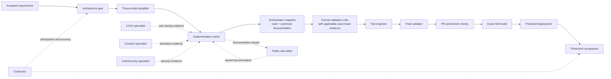

# Quality Gates

## Quality model

BetStan uses layered evidence. A passing unit test is necessary but not enough
for a cross-service feature, and a successful deployment command is not proof
that production is healthy.

The conductor coordinates the chain but does not replace a quality gate or
grant release authority.

The bounded consolidated design review described in [[Agents]] supports the
design-to-implementation handoff; it does not add a seventh universal gate.
Design acceptance and supporting test measurements cannot replace formal
candidate review or test acceptance. Snapshot creation is an authorized
orchestrator action, not permission for a file-editing developer to commit.

## Universal review chain

| Gate | Purpose | Required outcome |
|---|---|---|
| Architect | Define service boundaries, compatibility, dependencies, risks, and acceptance criteria | Bounded implementation contract |
| Simplifier | Challenge unnecessary scope and conflicting abstractions with three independent model families and one synthesis | Smallest complete design |
| Developer | Implement one owned slice with focused tests and assemble applicable documentation/specialist evidence | Complete candidate for the orchestrator's immutable snapshot |
| Validation critic | Search for concrete correctness, concurrency, compatibility, and regression failures | No unresolved required finding |
| Test engineer | Run the smallest targeted suite, then required regression tiers | Reproducible passing evidence |
| Final validator | Reconcile all requirements, specialist findings, tests, and exact-head evidence | Ready for release review |

## Conditional specialist gates

- Public documentation impact is assessed for every change. Invoke
  `betstan-public-wiki-editor` when impact is plausible or ambiguous; otherwise
  retain exact-diff, path-specific no-public-change evidence.
- `betstan-ux-ui-expert` is mandatory for every user-facing visual or
  interaction change.
- Shared HTTP, message, package, or persistence boundaries require the service
  contract reviewer.
- Authentication, session, identity, and authorization changes require the
  auth/security reviewer.
- CI or coverage changes require the quality-gate reviewer.
- Branch, PR, ancestry, or exact-SHA questions require the branch-governance
  reviewer.
- Infrastructure, deployment, rollback, migration, ingress, and runtime work
  require their matching operator or safety specialist.

Select review scope from the actual diff and current workflow, package, and
manifest inventories. Shared CI or contract changes include every genuine
affected consumer, not only a historical service list. Repository-only
evidence and runtime acceptance are distinct phases; each retains its
applicable checks.

See [[Agents]] for the complete catalog, direct handoffs, and supporting
evidence boundaries.

## Pull-request CI

Pull requests to `dev` or `master` run the production validation workflow. Its
required aggregate gate includes:

| CI area | What it proves |
|---|---|
| Manifest validation | Kubernetes YAML parses successfully |
| Ingress routing guard | Production hosts and API paths retain safe routing |
| Script validation | Deployment and runtime scripts parse and their focused contract tests pass |
| Workflow trigger guard | Production-capable workflows keep their intended triggers and trust boundaries |
| Deployment safety contracts | Readiness, activation, rollback, migration, and recovery invariants remain intact |
| Auth container smoke | A production-built Auth container typechecks, starts, and serves the expected API shape |
| Service coverage | Auth, Backoffice, Bet, Event, Gamemaster, Moderation, Resulting, Slip, Telemetry, and Client meet at least 80% line coverage and 80% branch coverage where branches exist |
| Client production build | The React application builds successfully in CI |

The OCI-specific validation workflow also checks workflow syntax and runs the
complete offline OCI contract suite.

### Reserved telemetry identity and inert coverage foundation

The repository reserves the single workflow identity `tests-telemetry` for a
future, separately authorized coverage-telemetry workflow. Until that
activation the production workflow inventory rejects a workflow file with a
`.yml` or `.yaml` extension when its filename stem case-normalizes to
`tests-telemetry`, and rejects a workflow name that normalizes to that identity,
so it cannot become ambiguous or duplicated. The workflow trigger guard invokes
the inventory to verify the exact production workflow set, but does not
independently parse workflow filenames or names to implement this reservation;
the inventory owns that rejection. The guard protects the inert foundation by
requiring its descriptor, package, lockfile, engine, and engine-test files to
exist as non-symlink files, and by checking that the engine retains pinned
integrity literals, including the reserved identity. It also pins both
inventory reservation-rule literals, the inventory test's reservation
completion sentinel, and the deployment-safety harness's Node-non-invocation
sentinel. Focused negative tests fail closed when inert files are missing or
symlinked, or when those pins are removed.

Alongside the reservation the repository carries an inert coverage descriptor
and its supporting tooling. The descriptor records eleven packages - Auth,
Backoffice, Bet, Client, Common, Event, Gamemaster, Moderation, Resulting, and
Slip, plus Telemetry - a pinned Node runtime, and the same 80% line and 80% branch thresholds
the current gate applies. The checked-in authorization inventory is empty, so
the foundation remains inert: the coverage engine is not an active required
check, and coverage continues to be enforced by the existing per-package
coverage gate. The unchanged production validation workflow remains the
execution boundary; in the ordinary default-equal state, where the engine and
its harness match the trusted default branch, policy evaluation returns before
reading the coverage review wrapper or its invocation contract, listing pull
request files, selecting an authorization, or executing Node or Docker.

The review wrapper
`infra/azure/agents/coverage-engine-review-stan.sh` and its invocation contract
are checked-in, trust-pinned assets only. `production-build.yml` does not yet
invoke the wrapper as an active coverage-review job. The deployment-safety
aggregate exercises its offline contract fixtures, but that test coverage must
not be represented as activated candidate review.

Any future engine and harness revision must be reviewed as one exact pair and
receive a separate authorization bound to its immutable source and evidence.
When that pair is activated, the review wrapper and invocation contract must
each match the trusted default at the pull base, pull head, and merge snapshot.
They therefore cannot be corrected or introduced in the activation pull
request. Any required wrapper or invocation correction is first promoted as a
normal default-equal pull request, synchronized into the trusted default, and
only then may a separate authorized pull request activate the engine-and-harness
pair.

That authority has two distinct, one-use proof legs: source integration into
`dev`, followed by canonical `dev`-to-`master` promotion. A successful source
integration receipt does not authorize promotion by itself. Promotion must
separately prove the exact authorized source merge, current branch lineage,
trusted workflow run and aggregate job, and unchanged engine-and-harness
content before candidate execution is allowed.

Stage 2A activation also requires a separately authorized workflow change that
invokes the wrapper with an explicitly mapped least-privilege GitHub read
token. Activated CI must reject a missing token, attach it only to GitHub API
requests, and keep it out of Docker arguments and environment, the candidate
environment, logs, diagnostics, and artifacts. API failures remain
fail-closed, with rate-limit and permission failures distinguishable from
malformed repository evidence. This inert foundation neither adds that token
wiring nor changes `production-build.yml`.

After promotion and branch synchronization, the promoted pair becomes the
ordinary trusted default and validation returns to the inert default-equal
state. Rollback is a separately reviewed forward correction or revert through
the normal branch flow, not reuse of an earlier authorization. Once either
one-use receipt has been spent, later correction must preserve that historical
interpretation rather than making the consumed authority appear unused.

## Application test layers

### Service tests

Backend services use Jest, TypeScript checking, in-memory MongoDB, and mocked
or controlled RabbitMQ channels. Tests cover routes, models, listeners,
publishers, retries, idempotency, compatibility, and concurrency.

Fallback and error-middleware tests send repeated unmatched requests, require
the bounded structured error, and then prove a documented valid route remains
available. In Express 4, rejected async handlers are not forwarded
automatically unless the service loads an explicit integration, so catch-all
routes must be covered against process-level unhandled rejection.

### Shared package tests

The Common package must:

- compile independently;
- pass current and legacy AMQP compatibility type checks;
- pass its runtime tests;
- build the exact packed artifact that will be published.

### Client tests

The client uses React tests plus Playwright browser coverage for:

- event, live, countdown, and retained-finished states;
- separate betting boards and bet history;
- responsive desktop/tablet/mobile behavior;
- v1/v2/v3 layout variants and affected themes;
- keyboard and accessible names;
- computed alignment, overflow, touch targets, and stable control ordering;
- public Backoffice discovery and use.

Rendered evidence is required when the claim depends on geometry, clipping,
focus, or dynamic interaction. A screenshot-only assertion is not enough.

## Domain-specific gates

### Messaging and compatibility

- old and new producers/consumers can overlap safely;
- duplicated and reordered messages are harmless;
- pending publication survives restart;
- optional fields preserve historical records;
- selection and settlement identity remain ID-based.

### Live betting

- deterministic corpus tests cover realistic normal and stoppage-time
  distribution;
- simulation restart produces the same authoritative outcome;
- quote, phase, market, and settlement transitions remain monotonic; every
  material validity-window advance receives a new quote version even when odds
  stay equal, fresh markets begin at quote version 1, and non-material markers
  preserve identity and expiry;
- Moderation retains same-price quote windows independently and accepts each
  only inside its own expiry and authority interval;
- every transition exposes no more than six non-terminal products, rotation
  settles before replacement, and market versions increase before a type
  re-enters;
- products with multiple same-side options moderate and settle by exact
  selection ID, with labels preserved across every service boundary;
- full-time history never makes a false completeness claim;
- live and pre-match slips cannot mix.

### UI/UX

- hierarchy and terminology match stable product patterns;
- sibling-card headings, controls, and odds baselines align;
- ordering is stable and preserves IDs;
- all required states remain visible and understandable;
- layouts avoid overflow and unnecessary vertical growth.

## Release and production gates

Before deployment:

- the promotion is the current reviewed `master` SHA;
- every declared feature/fix commit is an ancestor of that SHA; additional
  protected commits are allowed and validated as part of the aggregate;
- build and registry provenance are complete;
- required data dry-runs, migrations, and indexes are complete;
- any bounded one-off cleanup proves exact identity, zero financial
  dependencies, a verified recovery tombstone, and post-apply absence;
- a matching rollback baseline exists;
- no competing production operation is active.

After deployment:

- workloads run the expected digests;
- health, routing, TLS, APIs, SSE, queues, consumers, and storage pass;
- accelerated live acceptance proves a stable multi-event pre-kickoff slip
  separately from a moving in-play selection governed by one event clock;
- every bounded in-play placement attempt records quote identity, expiry,
  immutable submission time, and decline details before the final success
  assertion;
- acceptance observes each fact on its owning public read model: Event proves
  phase, score, and terminal market state, while Bet history proves accepted
  quote identity, winning selection, settlement reason/sequence, and outcome;
- a non-void synthetic live market must resolve to exact `WIN` or `LOSS`;
  unexpected `VOID` fails acceptance;
- the browser acceptance journey has no page, console, API, or log errors;
- when fallback routing changes, bounded unknown-route probes return the
  application error, documented REST/SSE routes remain healthy, and target-pod
  restart counts do not change;
- activation is committed only after its bounded acceptance succeeds.

## Evidence rules

- Evidence belongs to an exact immutable SHA.
- Pull request titles are short, understandable outcomes; merge safety rejects
  single-word, overlong, or ambiguous `chore`/`misc`/`wip` titles.
- A skipped, stale, pending, unrelated, or branch-name-only check is not
  success.
- A rerun cannot replace first-attempt provenance when the contract requires
  attempt one.
- Reviewers do not approve their own implementation.
- Corrections return to the same logical owner and gate.
- Release documentation records scope, exclusions, validation, risk, release
  impact, rollback, and remaining work.

Independently verified immutable facts may be reused after binding them to
the consuming work unit's root request, exact refs, scope, and complete
changed-path and consumer coverage. Retain their original source identity;
stale results, sibling-worktree assertions, and unverifiable summaries are
not authority. Reuse does not replace fresh mutable-ref, current-source,
local-state, or authority checks at required boundaries, or required
exact-SHA CI. Repeat substantive review when changed substantive evidence, an
unresolved finding, or a concrete scope risk requires it, not for an unchanged
report.

### Non-regression acceptance

Preserving working behavior is an acceptance obligation, not a zero-regression
guarantee. Identify the affected contracts before editing. A demonstrated fix
needs a targeted failing regression, positive compatibility cases for the
working path, and the relevant existing negative cases. Run focused checks
and the genuinely required regression and CI tiers; neither prose assertions
nor unnecessary duplicate full-suite runs improve the evidence.

A known regression, unexplained behavior change, or missing required proof
prevents readiness. Report actual results and unrun checks explicitly.
Independent critic, test, and final-validation evidence remains required;
routine routing or design acceptance cannot turn a failed technical gate
green. See [[Agents]] for bounded corrections and review triggers.

## Documentation quality

Documentation-impact evidence is mandatory for every change; a separate
public-wiki supporting unit is not. Canonical wiki pages are reviewed source
files, and relevant changes join the complete candidate in the same pull
request as the behavior they describe, before formal critic review and final
validation. Their tests require the expected handbook pages and navigation, and
reject known classes of sensitive public content such as private authority
mechanics, user-specific paths, and globally routable infrastructure
addresses. After the exact commit merges, the authorized orchestrator, not
the wiki editor, publishes canonical pages byte-identically and verifies the
public result as described in [[Release Orchestration]]. Local documentation
readiness does not claim immutable-candidate validation or publication.

## Related pages

- [[Agents]]
- [[Security]]
- [[Release Orchestration]]
- [[UI UX Consistency]]
