# Release Orchestration

## Release principles

BetStan releases are built around one rule: every review, build, deployment,
activation, and rollback decision must resolve to an exact immutable source
and artifact identity.

Production is never updated directly from a developer worktree, a mutable
image tag, a stale branch name, or an unverified workflow rerun.

## Branch flow

1. Create a focused feature, fix, operations, or documentation branch.
2. Open a pull request to `dev`.
3. Pass the exact-head and merge-snapshot quality gates.
4. Merge the focused change into `dev`.
5. Promote an up-to-date `dev` to `master` through a separate pull request.
6. Synchronize the resulting `master` ancestry back into `dev`.

Direct pushes to `dev` or `master` are not part of the supported flow. Only
`dev` may be promoted to `master`.

### Concurrent feature delivery

Several development sessions may prepare and merge compatible features at the
same time. A production promotion may therefore contain more than one reviewed
feature. The release contract is inclusion-based rather than
session-exclusive:

1. each session records the protected commit or commits required for its
   outcome;
2. the release selects the exact current `master` SHA;
3. every required commit must be an ancestor of that SHA;
4. the complete aggregate SHA receives fresh build, data, rollback, and
   acceptance evidence.

Additional protected commits are not a reason to reset `master`, discard
another session's work, or deploy an older candidate. If `master` advances
during a release chain, the older chain is superseded and the new current
candidate is used when it still contains all required commits.

Development, review, and branch integration can remain concurrent. Production
dispatches, data changes, deployments, activation, rollback, and recovery stay
serialized so two sessions cannot mutate the live system at the same time.

On resume after another session's release, reconcile current protected
`master`, the actual deployed generation, and the exact retained artifacts
before selecting remaining work. Source promotion and deployed state are
different facts. Do not replay an old data, infrastructure, deployment,
activation, or recovery plan from stale notes. Reuse unchanged source reviews
only under [[Agents]]; current runtime and release provenance still need their
own evidence. Respect an explicit pause rather than interpreting resume
notes as authority to continue operations.

## End-to-end release structure

```mermaid
flowchart LR
    Branch["Focused branch"] --> Docs["Documentation-impact assessment"]
    Docs --> Candidate["Complete code + canonical documentation<br/>under the accepted design"]
    Docs -. affected pages .-> Wiki["Canonical public wiki<br/>edited in the same PR"]
    Wiki --> Candidate
    Candidate --> DevPR["PR to dev"]
    DevPR --> Snapshot["Authorized orchestrator<br/>immutable candidate"]
    Snapshot --> DevChecks["Applicable exact-head reviews,<br/>formal critic, tests, final validation + CI"]
    DevChecks --> Dev["dev"]
    Dev --> Promote["dev to master PR"]
    Promote --> MergeChecks["Exact head and<br/>merge-snapshot checks"]
    MergeChecks --> Master["master"]
    Master --> Build["Exact-SHA builds"]
    Build --> Registry["Immutable GHCR digests"]
    Registry --> Infra["Infrastructure and<br/>data readiness"]
    Infra --> Deploy["Protected deployment"]
    Deploy --> Dark["Dark validation"]
    Dark --> Activate["Bounded activation"]
    Activate --> Accept["Production acceptance"]
    Accept --> Commit["Permanent enablement"]
    Master --> Sync["Synchronize ancestry<br/>back to dev"]
```

Documentation-only changes use the same reviewed branch and promotion model.
They do not require a runtime deployment when no runtime artifact changed.

## Pull-request evidence

Every pull request records:

- a short plain-language title that describes the outcome rather than an
  ambiguous category such as `chore`, `misc`, or `wip`;
- why the change exists;
- exact base and head identity;
- scope and explicit exclusions;
- compatibility and migration effects;
- user-facing consistency impact;
- commands and results;
- release and rollback impact;
- unresolved exceptions or remaining work.

Each PR also has public-safe GitHub labels for traceability:

- `session:<slug>` identifies the bounded development session;
- `feature:<slug>` groups the durable product or engineering feature.

The same pair follows implementation, promotion, and ancestry-sync PRs. A
shared promotion can carry several pairs when it aggregates work from multiple
sessions. These labels are informational only: they do not satisfy or change
checks, approvals, merge policy, release authority, deployment, activation, or
rollback. Internal session identifiers, local paths, user identities,
credentials, private runtime references, and production identifiers are never
used as public labels.

Metadata is part of the reviewed evidence. It is completed before the release
critical path rather than repeatedly edited while production work is active.
Title/body edits can start validation. Avoid metadata changes while the
publisher evaluates its snapshot, during a data-to-deploy handoff, or inside
a production-exclusivity window.

Context-label setup reads the PR's labels first. If both informational context
labels are already present, it performs no GitHub mutation. Otherwise it
ensures and adds only the missing labels in one PR edit. An initial read
failure performs no blind mutation and retains the caller's warning or
strict-failure behavior. This prevents avoidable metadata churn; it does not
change managed-label authority or replace the fresh-transition recovery
described in [[Quality Gates]].

## Quality chain

The universal quality gates are:

1. architect;
2. three-model simplifier synthesis;
3. registered implementation owner;
4. validation critic;
5. test engineer;
6. final validator.

The conductor spans the chain but is not a quality gate.
`betstan-ux-ui-expert` is mandatory for every user-facing visual or
interaction change. Other specialists join when their explicit trigger
applies.

Every change records documentation impact. The public-wiki editor is a
supporting unit when public impact is plausible or ambiguous, not a universal
quality gate.

The consolidated design review, single candidate assembly owner, supporting
test evidence, and direct handoffs follow [[Agents]]. They do not add another
release or documentation gate. Source acceptance remains separate from
runtime authorization and the selected procedure's operational checks.

No agent may approve its own implementation, and no agent verdict replaces
GitHub branch protection or protected-environment approval.

## Approval model

Approval is classified by origin:

- Copilot CLI-created and CLI-owned pull requests and protected operations,
  including downstream workflows whose ownership is proven by the canonical
  policy, may use the bounded no-personal-prompt path after every technical,
  lineage, review, and exclusivity check passes;
- a human-originated pull request or protected operation remains personally
  approved;
- neither path can skip required tests, exact-SHA provenance, environment
  controls, genuine wait timers, first-attempt provenance, serialization,
  locks/fences, rollback readiness, or post-deployment validation.

Using a CLI command, sharing an actor identity, carrying a label, or appearing
in a recent-run list does not by itself prove ownership. A technical context
failure or uncertain authority is a blocker, not a request for personal
consent and not permission to adopt human-originated work.

The implementation uses private, one-operation authority records outside the
repository. Their payloads and state transitions are deliberately not
documented on the public wiki.

## Build and registry

- A push to the production branch starts the first-attempt production build.
- Service images are tied to the full source SHA.
- OCI-compatible images are published to public GHCR.
- Deployment references immutable digests.
- Registry validation proves repository linkage, image architecture, source
  provenance, and anonymous pull.
- Retention protects the current, candidate, and rollback generations before
  deleting older images.

When downstream provenance requires attempt one, a failed run remains failed
evidence. The correction creates a fresh exact candidate rather than
retroactively turning a rerun into the original trusted build.

## Infrastructure and data handoff

Before deployment, the release chain verifies:

- current infrastructure provenance and capacity;
- explicit, hash-covered upstream run and artifact identities before one-use
  authority, immediately before approval, and before workflow cloud access;
- the protected job's injected runtime mode still equals the dispatch-bound
  mode, with current-`master` checks before and after upstream validation;
- complete paginated artifact inventories, current first-attempt identity, and
  chronological GHCR build -> package validation -> k3s capacity lineage;
- exact bounded artifact contents, including package-validation evidence naming
  the exact build run it inspected and capacity evidence naming its candidate
  and upstream runs;
- current `master` identity;
- image digest availability;
- migration and schema compatibility;
- dry-run results;
- for non-dry-run k3s data maintenance, a root filesystem at or below the
  fixed 70 percent limit before database locking or maintenance begins;
  over-limit nodes stop before data mutation and use the bounded recovery
  described in [[Infrastructure]];
- required backfills and indexes;
- public-write fencing and writer quiescence when data mutation requires it;
- a matching pre-mutation rollback baseline;
- fixed-target data operators whose journal binds the exact preimage, target,
  source SHA, apply state, verification state, and rollback state;
- absence of competing production operations.

**Pending fixed Backoffice cleanup.** The protected live-data chain adds one
fixed-boundary Backoffice projection cleanup without creating a separate
production path:

1. `dry-run` performs the existing fixed-reschedule preflight, then the
   Backoffice cleanup preflight, before the compatibility-backfill and Slip
   index preflights;
2. `apply-backfills` completes and verifies the existing fixed reschedule, then
   runs the Backoffice cleanup in preflight mode only;
3. `apply-slip-index` first reverifies the fixed reschedule, completes the
   existing backfill and index work, then runs cleanup preflight, apply, and
   verify. Cleanup apply is the last fenced database mutation.

Production execution is permitted only through the protected workflow at the
exact current `master` SHA. Every phase stops if the existing reschedule is not
safely applied, completed, or resumable; the cleanup cannot skip or replace
that prerequisite. No production workflow has been dispatched for this
change.

Mutating phases quiesce the seven writers: Backoffice, Bet, Event, Gamemaster,
Moderation, Resulting, and Slip. Backoffice quiesces first so its projection
cannot race the cleanup and restores last. Auth and Client remain served as
readers, while `/api/backoffice` is expected to return fenced `503` responses
during mutation. The final phase retains the established write fence and
database-lock handoff for deployment.

Once `apply-slip-index` has entered maintenance, that safety boundary remains
in place regardless of how the phase ends. Success transfers it to deployment;
failure, cancellation, or handoff-evidence failure re-establishes seven-writer
quiescence and retains the shared database lock instead of restoring the prior
runtime. Recovery at the same exact source can re-enter and verify an
already-applied cleanup without expanding its fixed target set. A retained
hold is a safe unavailable state, not evidence that production execution
occurred or authority to begin another operation.

New sanitized evidence uses `live-betting-v5` and requires
`backoffice_pre_september_cleanup_complete` in the final handoff. The verifier
keeps the literal historical meanings of `live-betting-v1` through `v4` and
rejects an unknown `v6`; a newer label cannot reinterpret older evidence. The
cleanup command has no rollback phase, so release rollback continues to use
the protected baseline, fence, lock, and recovery model described below.

If an already-dispatched but unissued operation loses a prerequisite, its
exact request and run remain serialized until bounded, reviewed recovery proves
the exact source identity safe to retire. Ambiguity, partial execution, or
provenance drift remains a blocker. Recovery preserves one-use authority
evidence and cannot grant new dispatch, approval, or mutation authority or
bypass protected approval.

Repository-global exclusivity prevents incomplete evidence from being silently
replaced while active production work remains fenced. Before provider mutation,
the active job revalidates the exact source, runtime mode, upstream provenance,
approval authority, and exclusivity. Any failure stops before mutation without
weakening the protected evidence.

Two frozen, policy-resolved workflows -- the live-data handoff and live-betting
activation -- share one narrowly allowlisted transition proof for disabled
history that is fully unmaterialized. Only these two workflows can ever become
candidates through this path; every other workflow and operation keeps its
default classification and blocking rules unchanged. Before external
enablement, the dispatcher seals the complete evidence-derived candidate set
for the request's own resolved workflow in a repository-global prepared intent
that blocks every competing protected request. After enablement it re-collects
the complete production inventory twice, requires the same workflow identity
and evidence with no other active work, and atomically crosses into the
existing ambiguous dispatch state immediately before the provider call. The
transition never names, excludes, cancels, or deletes historical runs, and it
does not weaken the default rule that active work on either workflow blocks.
A prepared intent may be discarded only while its own workflow remains
disabled; after the dispatch boundary, exact capture recovery is required, and
issued or consumed authority remains one-use. If the exact bound run is
subsequently validated as terminal and jobless and its authority is retired, a
fresh preparation may create a new generation for the same request. For only
these two workflows,
`copilot-cli-dispatch-stan.sh <request-file> --retire-zero-execution` derives
that run ID from the exact bound preparation and cannot select another run. It
may retire consumed authority only when the retained same-run approval is
valid, no approval is in flight, and all preserved request, source, and
workflow evidence still agrees, historical control remains valid, and the
immutable workflow is first-attempt-only. Two canonically identical, complete
terminal observations must show that every attempt performed zero execution:
attempt one was non-successful, later attempts were skipped, no runner or steps
were assigned, and no artifacts or pending approval gates exist. Immediate
version and control revalidation may then write only the strict v4
`approved-zero-execution` retirement variant. Existing v1/v2/v3,
claimed/jobless, and prerequisite-rejection semantics remain unchanged.
Retirement changes only local authority state and adds immutable proof,
preserving the original request, receipt, run identity, first-attempt identity,
capture, seal, and intent. It performs no cancellation, rerun, approval,
enablement, dispatch, provider, or data operation. A later explicit normal
preparation archives the spent generation before replacing the same prepared
slot and validates current prerequisites; preparation itself creates no run or
approval. A subsequent normal dispatch receives a distinct run ID at executable
attempt one, its own authority, and a new approval receipt, with no silent
cancellation override or inherited approval. New-schema records require
compatible readers or reviewed forward correction, never downgrade relabeling
or deletion. Per-request one-use rules and repository-global active, inflight,
and exclusivity boundaries remain distinct and unchanged; the spent generation
stays preserved and cannot be reopened or replayed, and the two target
workflows can never consume or reuse each other's requests, observations,
seals, or prepared context.

The final data phase hands its lock and maintenance state directly to the
matching deployment. That prevents an application rollout from racing a
schema, index, rollback, or recovery operation.

## Deployment

Deployment proceeds in dependency-safe order:

1. make shared data services ready, roll out Telemetry, and apply its canonical
   and diagnostic API routes before instrumented Client traffic;
2. roll out the remaining services sequentially in the checked-in deployment
   order;
3. verify each live workload is ready and running its expected digest before
   continuing;
4. deploy Gamemaster last so event production starts only after its consumers
   are healthy;
5. validate routes, TLS, response shapes, SSE, storage, queues, consumers, and
   restart state.

A successful deployment command is not the release conclusion. Protected and
public validation must both pass.

### Compatibility-first producer changes

When a producer begins persisting or publishing a new additive enum value, the
immediately previous production generation must already understand that value.
Use two immutable releases:

1. deploy a compatibility baseline in which consumers, persistence schemas,
   clients, and the producer's replay and manual-recovery paths accept the new
   value, while generation remains on the old engine;
2. capture and validate that compatibility baseline as the rollback source;
3. deploy the producer activation that starts creating the new value.

Do not activate the producer change with a pre-compatibility rollback image.
The rollback target for that activation is the compatibility baseline, so
persisted transitions and historical rows remain readable after rollback.

## Activation

User-facing live behavior is activated separately from image deployment.

1. Enable the feature under a bounded lease.
2. Run the full browser and API acceptance journey.
3. Create and complete synthetic events.
4. Place and settle separate live and pre-match bets.
5. Check moderation, SSE, history, Backoffice, queues, workloads, and logs.
6. Permanently commit activation only after all evidence passes.
7. On failure, disable the feature and restore the known safe state.

This separates "the code is deployed" from "the feature is safe to expose."

## Rollback and recovery

Every production deployment captures the exact previous application generation
before mutation.

A rollback requires:

- an exact historical source and image set;
- a matching baseline artifact;
- compatibility with the current database and message state;
- healthy queues, consumers, storage, and workloads;
- a defined write-fence or drain when the old version cannot process new
  pending work;
- post-rollback digest and application validation.

The fixed cleanup adds a separate fail-closed rollback compatibility decision.
A well-formed authoritative result proving that its journal is absent leaves
the existing rollback gates in force. A prepared journal blocks rollback and
requires recovery by its exact source. An applied journal permits only an
exact rollback target whose Backoffice listener acknowledges valid pre-cutoff
deliveries before any projection write. Missing required, unreadable,
malformed, duplicate, or unknown evidence blocks rather than being treated as
absence.

Ordinary and maintenance-aware rollback independently bind that exact-target
capability before workload mutation. A Backoffice generation from before the
listener guard is therefore not restorable after the cleanup is applied: a
queued or delayed valid pre-cutoff `NEW_EVENT` delivery must not recreate a
deleted projection. Pending-publication replay-or-drain compatibility remains
a separate mandatory decision; satisfying either the cleanup or publication
decision cannot satisfy the other.

Current ten-application baselines must bind the complete authenticated image
inventory to matching live-image and deployment inventories, including matching
checksum-bound retained Telemetry state. New ordinary historical
nine-application captures must positively prove Telemetry absent; archived
legacy baselines retain the existing reconstruction of provenance from their
exact deployment. The explicitly authenticated split-recovery form remains
distinct: a nine-application image manifest plus separately bound retained
Telemetry, not a rewritten ten-image manifest. Service count, observed presence,
and retention mode alone are not authority. Missing, unreadable, or
contradictory evidence fails closed; recomputing local checksums cannot
downgrade an authenticated ten-application baseline to a historical one.

Historical pre-Telemetry rollback restores only the nine historical
application images and rejects ten-application baselines before mutation.
During that transition, the retained observer must keep
serving a well-formed summary, while its intentionally coarse service states
may be green, yellow, or red as older workloads start. Once all nine historical
applications are exact and ready, terminal rollback removes the Telemetry API
routes, Service, and Deployment. Its durable queue, logical database, and
records remain; no historical Telemetry image is invented.

If a rollback fails after partial mutation, recovery restores the exact
pre-run ten-application state, including the Telemetry image and public routes,
and keeps writes fenced until health is proven. Data restore is used only when
application rollback is insufficient and separately justified.

An incomplete deployment that re-enters maintenance leaves production
deliberately fenced: writers are quiesced, mutating requests are refused, and
the transferred database lock is retained. That state is safe, but ordinary
rollback readiness requires a healthy steady state, so the last known-good
generation would otherwise be unreachable exactly when it is needed. A
maintenance-aware rollback closes that gap. It never waives a check and is not
a skip or force switch: it asserts the expected fenced state positively, and is
usable only when bound to the exact incomplete deployment, its immutable
baseline, the exact deployed generation, and the exact rollback target. It
restores the baseline digests and replica counts, proves the previously failing
workload is stable, releases the database lock and then the write fence in that
order, and finally requires ordinary steady-state readiness. Any failure
re-holds maintenance and reports the true lock state.

Recovery from a ten-application baseline is limited to this eligible
failed-deployment, maintenance-fenced path. For retained Telemetry, this path
supports only a single-replica baseline and rejects unsupported replica counts
before workload mutation. Complete input validation precedes the existing
nine-application restore and separate Telemetry restore, with the same locks,
fences, failure re-hold, and readiness checks. This does not enable
ordinary unfenced rollback after a successful ten-application deployment.
Data-preparation and deployment gates validate baseline evidence; they do not
establish ordinary rollback capability.

Mongo maintenance resumes the ingress controller only after exact version,
compatibility-version, and image verification, before applying the Telemetry
ingress. This restores admission readiness without thawing application writers;
deployment failure recovery remains armed until deployment completes. Fenced
rollback also recognizes the deployment cleanup's exact candidate Auth and
Client images over an ordered candidate-prefix/baseline-suffix writer rollout.
It does not accept arbitrary mixed generations: immutable image evidence,
seven-writer quiescence, the write fence, Telemetry resource and route
constraints, and lock ownership remain mandatory. No database restore is added.

When applied-data recovery resumes from that retained hold, each quiesced
writer may use either its exact failed-deployment candidate image or its own
checksum-bound pre-deployment baseline image, allowing a partially completed
sequential rollout to continue safely. Auth and Client remain on their exact
candidate images, while released-runtime recovery requires all nine candidate
images. Baseline provenance, ancestry, quiescence, readiness, locks, fences,
and every pre-mutation check remain fail-closed.

A generation that failed its own deployment is never an accepted rollback
baseline.

## Stall and incident handling

The conductor monitors the real blocking object: agent result, process,
GitHub job, protected approval, handoff, or runtime health signal.

Keep one operation owner and one observer for each owned release chain.
Retain exact owned runs in the existing durable work-unit evidence across
resume; a recent-run list is discovery, not ownership or a reason to forget a
known run. Reconcile the exact run and its proven downstream work after each
job or approval transition, even when the top-level status is unchanged.

- **ACT:** an exact CLI-owned gate is eligible. The conductor immediately
  routes the authorized orchestrator to the canonical approval path, even if
  a timer also exists; the timer remains effective.
- **WAIT:** exact evidence proves an already-approved timer or provider wait.
  Retain bounded observation without submitting a duplicate approval.
- **BLOCK:** invalid local context, missing required proof, unresolved
  authority, source/ownership drift, or unknown evidence prevents safe action.
  State the technical reason. Human-originated operations retain their own
  personal approval path.

These are caller actions, not a new authority framework or critic queue.
Captured dispatch or issued authority is not proof that jobs and the expected
gate have materialized. Approval submission and an intermediate green job
are not terminal release evidence.

- A running watcher is notification transport, not proof of progress.
- A waiting state is classified immediately rather than left to a watcher.
- Approval eligibility comes from the machine-readable protected-operation
  policy and exact durable authority, never an agent's remembered workflow
  category; the conductor routes an eligible CLI-issued gate to the authorized
  orchestrator in the same checkpoint. The conductor does not submit approval.
- One missed checkpoint triggers bounded recovery.
- Two missed checkpoints require a concrete safe action or an explicit
  blocker.
- Failed or missing first-attempt provenance is never repaired with an empty
  commit or an unsafe bypass.
- A terminal workflow that leaves a write fence, operation lock, unavailable
  ingress, or unhealthy workload is an active production incident.
- A proven repository-policy false block is corrected narrowly, with focused
  regression coverage, through the normal branch path.

Routine routing, acknowledgements, timers, and obvious scope corrections stay
with the conductor. Advisory drift or delay blocks only affected dependants;
it cannot freeze independently authorized eligible approval, safe completion,
or incident recovery. Required technical proof still gates its operation.
Use the bounded checkpoints and original correction budgets in [[Agents]],
not a new review round for every status change. Preserve compatibility and
spent authority evidence through any reviewed correction or rollback.

## Documentation impact and public-wiki support

Every change records a documentation-impact assessment. Register the
public-wiki editor when impact is plausible or ambiguous. A clearly no-impact
change instead records the inspected exact-diff paths and its justification.
Product behavior, architecture, contracts, data lifecycle, security,
infrastructure, quality gates, release behavior, UI/UX, and agent-role changes
update their canonical `docs/wiki/` pages in the same pull request before
formal critic review of the immutable candidate and final validation. The
editor returns its owned pages and evidence to the implementation owner
assembling the candidate; the authorized orchestrator creates its immutable
snapshot.

After the exact protected commit merges, the authorized orchestrator, not the
public-wiki editor, publishes changed canonical pages to the GitHub wiki.
Bind publication to that merged commit, not a mutable branch or local
worktree. Verify byte-for-byte equality of `docs/wiki/*.md` with the published
counterparts, including unchanged pages that need no rewrite. Do not reformat
content or make wiki-only policy corrections.

Verify published navigation, links, heading anchors, and rendered diagrams.
Record the source commit, wiki revision, page set, and verification outcome;
a mismatch or broken publication returns to its owner and is not complete.
Matching reusable-agent guidance, PR/release evidence, and explicit accepted
exceptions remain part of the handoff when applicable. Local documentation
readiness is neither final candidate acceptance nor a claim of publication.

Private runtime identifiers, credentials, approval records, and emergency
procedures remain outside the public wiki.

## Related pages

- [[Quality Gates]]
- [[Agents]]
- [[Infrastructure]]
- [[Security]]
- [[Engineering Learnings]]
