# Release Orchestration

## Release principles

BetStan releases are built around one rule: every review, build, deployment,
activation, and rollback decision must resolve to an exact immutable source
and artifact identity.

Production is never updated directly from a developer worktree, a mutable
image tag, a stale branch name, or an unverified workflow rerun.

## Branch flow

1. Create a focused feature, fix, operations, or documentation branch.
2. Open a pull request to `dev`.
3. Pass the exact-head and merge-snapshot quality gates.
4. Merge the focused change into `dev`.
5. Promote an up-to-date `dev` to `master` through a separate pull request.
6. Synchronize the resulting `master` ancestry back into `dev`.

Direct pushes to `dev` or `master` are not part of the supported flow. Only
`dev` may be promoted to `master`.

### Concurrent feature delivery

Several development sessions may prepare and merge compatible features at the
same time. A production promotion may therefore contain more than one reviewed
feature. The release contract is inclusion-based rather than
session-exclusive:

1. each session records the protected commit or commits required for its
   outcome;
2. the release selects the exact current `master` SHA;
3. every required commit must be an ancestor of that SHA;
4. the complete aggregate SHA receives fresh build, data, rollback, and
   acceptance evidence.

Additional protected commits are not a reason to reset `master`, discard
another session's work, or deploy an older candidate. If `master` advances
during a release chain, the older chain is superseded and the new current
candidate is used when it still contains all required commits.

Development, review, and branch integration can remain concurrent. Production
dispatches, data changes, deployments, activation, rollback, and recovery stay
serialized so two sessions cannot mutate the live system at the same time.

## End-to-end release structure

```mermaid
flowchart LR
    Branch["Focused branch"] --> DevPR["PR to dev"]
    DevPR --> DevChecks["Architecture, review,<br/>tests, and trusted CI"]
    DevChecks --> Dev["dev"]
    Dev --> Docs["Documentation-impact evidence"]
    Docs --> Promote["dev to master PR"]
    Docs -. affected pages .-> Wiki["Canonical public wiki<br/>updated in the PR"]
    Wiki -. included before review .-> Promote
    Promote --> MergeChecks["Exact head and<br/>merge-snapshot checks"]
    MergeChecks --> Master["master"]
    Master --> Build["Exact-SHA builds"]
    Build --> Registry["Immutable GHCR digests"]
    Registry --> Infra["Infrastructure and<br/>data readiness"]
    Infra --> Deploy["Protected deployment"]
    Deploy --> Dark["Dark validation"]
    Dark --> Activate["Bounded activation"]
    Activate --> Accept["Production acceptance"]
    Accept --> Commit["Permanent enablement"]
    Master --> Sync["Synchronize ancestry<br/>back to dev"]
```

Documentation-only changes use the same reviewed branch and promotion model.
They do not require a runtime deployment when no runtime artifact changed.

## Pull-request evidence

Every pull request records:

- a short plain-language title that describes the outcome rather than an
  ambiguous category such as `chore`, `misc`, or `wip`;
- why the change exists;
- exact base and head identity;
- scope and explicit exclusions;
- compatibility and migration effects;
- user-facing consistency impact;
- commands and results;
- release and rollback impact;
- unresolved exceptions or remaining work.

Each PR also has public-safe GitHub labels for traceability:

- `session:<slug>` identifies the bounded development session;
- `feature:<slug>` groups the durable product or engineering feature.

The same pair follows implementation, promotion, and ancestry-sync PRs. A
shared promotion can carry several pairs when it aggregates work from multiple
sessions. These labels are informational only: they do not satisfy or change
checks, approvals, merge policy, release authority, deployment, activation, or
rollback. Internal session identifiers, local paths, user identities,
credentials, private runtime references, and production identifiers are never
used as public labels.

Metadata is part of the reviewed evidence. It is completed before the release
critical path rather than repeatedly edited while production work is active.

## Quality chain

The universal quality gates are:

1. architect;
2. three-model simplifier synthesis;
3. registered implementation owner;
4. validation critic;
5. test engineer;
6. final validator.

The conductor spans the chain but is not a quality gate.
`betstan-ux-ui-expert` is mandatory for every user-facing visual or
interaction change. Other specialists join when their explicit trigger
applies.

Every change records documentation impact. The public-wiki editor is a
supporting unit when public impact is plausible or ambiguous, not a universal
quality gate.

No agent may approve its own implementation, and no agent verdict replaces
GitHub branch protection or protected-environment approval.

## Approval model

Approval is classified by origin:

- a Copilot CLI-created and CLI-owned pull request may use the bounded
  no-personal-prompt path after every technical, lineage, review, and
  exclusivity check passes;
- a human-originated pull request or protected operation remains personally
  approved;
- neither path can skip required tests, exact-SHA provenance, environment
  controls, rollback readiness, or post-deployment validation.

The implementation uses private, one-operation authority records outside the
repository. Their payloads and state transitions are deliberately not
documented on the public wiki.

## Build and registry

- A push to the production branch starts the first-attempt production build.
- Service images are tied to the full source SHA.
- OCI-compatible images are published to public GHCR.
- Deployment references immutable digests.
- Registry validation proves repository linkage, image architecture, source
  provenance, and anonymous pull.
- Retention protects the current, candidate, and rollback generations before
  deleting older images.

When downstream provenance requires attempt one, a failed run remains failed
evidence. The correction creates a fresh exact candidate rather than
retroactively turning a rerun into the original trusted build.

## Infrastructure and data handoff

Before deployment, the release chain verifies:

- current infrastructure provenance and capacity;
- explicit, hash-covered upstream run and artifact identities before one-use
  authority, immediately before approval, and before workflow cloud access;
- the protected job's injected runtime mode still equals the dispatch-bound
  mode, with current-`master` checks before and after upstream validation;
- complete paginated artifact inventories, current first-attempt identity, and
  chronological GHCR build -> package validation -> k3s capacity lineage;
- exact bounded artifact contents, including package-validation evidence naming
  the exact build run it inspected and capacity evidence naming its candidate
  and upstream runs;
- current `master` identity;
- image digest availability;
- migration and schema compatibility;
- dry-run results;
- required backfills and indexes;
- public-write fencing and writer quiescence when data mutation requires it;
- a matching pre-mutation rollback baseline;
- fixed-target data operators whose journal binds the exact preimage, target,
  source SHA, apply state, verification state, and rollback state;
- absence of competing production operations.

If an already-dispatched but unissued operation loses a prerequisite, its
exact request and run remain serialized until bounded, reviewed recovery proves
the exact source identity safe to retire. Ambiguity, partial execution, or
provenance drift remains a blocker. Recovery preserves one-use authority
evidence and cannot grant new dispatch, approval, or mutation authority or
bypass protected approval.

Repository-global exclusivity prevents incomplete evidence from being silently
replaced while active production work remains fenced. Before provider mutation,
the active job revalidates the exact source, runtime mode, upstream provenance,
approval authority, and exclusivity. Any failure stops before mutation without
weakening the protected evidence.

Two frozen, policy-resolved workflows -- the live-data handoff and live-betting
activation -- share one narrowly allowlisted transition proof for disabled
history that is fully unmaterialized. Only these two workflows can ever become
candidates through this path; every other workflow and operation keeps its
default classification and blocking rules unchanged. Before external
enablement, the dispatcher seals the complete evidence-derived candidate set
for the request's own resolved workflow in a repository-global prepared intent
that blocks every competing protected request. After enablement it re-collects
the complete production inventory twice, requires the same workflow identity
and evidence with no other active work, and atomically crosses into the
existing ambiguous dispatch state immediately before the provider call. The
transition never names, excludes, cancels, or deletes historical runs, and it
does not weaken the default rule that active work on either workflow blocks.
A prepared intent may be discarded only while its own workflow remains
disabled; after the dispatch boundary, exact capture recovery is required, and
issued or consumed authority remains one-use. If the exact bound run is
subsequently validated as terminal and jobless and its authority is retired, a
fresh preparation may create a new generation for the same request. The spent
generation remains preserved and cannot be reopened or replayed, and the two
target workflows can never consume or reuse each other's requests,
observations, seals, or prepared context.

The final data phase hands its lock and maintenance state directly to the
matching deployment. That prevents an application rollout from racing a
schema, index, rollback, or recovery operation.

## Deployment

Deployment proceeds in dependency-safe order:

1. make shared data services ready, roll out Telemetry, and apply its canonical
   and diagnostic API routes before instrumented Client traffic;
2. roll out the remaining services sequentially in the checked-in deployment
   order;
3. verify each live workload is ready and running its expected digest before
   continuing;
4. deploy Gamemaster last so event production starts only after its consumers
   are healthy;
5. validate routes, TLS, response shapes, SSE, storage, queues, consumers, and
   restart state.

A successful deployment command is not the release conclusion. Protected and
public validation must both pass.

### Compatibility-first producer changes

When a producer begins persisting or publishing a new additive enum value, the
immediately previous production generation must already understand that value.
Use two immutable releases:

1. deploy a compatibility baseline in which consumers, persistence schemas,
   clients, and the producer's replay and manual-recovery paths accept the new
   value, while generation remains on the old engine;
2. capture and validate that compatibility baseline as the rollback source;
3. deploy the producer activation that starts creating the new value.

Do not activate the producer change with a pre-compatibility rollback image.
The rollback target for that activation is the compatibility baseline, so
persisted transitions and historical rows remain readable after rollback.

## Activation

User-facing live behavior is activated separately from image deployment.

1. Enable the feature under a bounded lease.
2. Run the full browser and API acceptance journey.
3. Create and complete synthetic events.
4. Place and settle separate live and pre-match bets.
5. Check moderation, SSE, history, Backoffice, queues, workloads, and logs.
6. Permanently commit activation only after all evidence passes.
7. On failure, disable the feature and restore the known safe state.

This separates "the code is deployed" from "the feature is safe to expose."

## Rollback and recovery

Every production deployment captures the exact previous application generation
before mutation.

A rollback requires:

- an exact historical source and image set;
- a matching baseline artifact;
- compatibility with the current database and message state;
- healthy queues, consumers, storage, and workloads;
- a defined write-fence or drain when the old version cannot process new
  pending work;
- post-rollback digest and application validation.

Historical pre-Telemetry rollback restores only the nine historical
application images. During that transition, the retained observer must keep
serving a well-formed summary, while its intentionally coarse service states
may be green, yellow, or red as older workloads start. Once all nine historical
applications are exact and ready, terminal rollback removes the Telemetry API
routes, Service, and Deployment. Its durable queue, logical database, and
records remain; no historical Telemetry image is invented.

If a rollback fails after partial mutation, recovery restores the exact
pre-run ten-application state, including the Telemetry image and public routes,
and keeps writes fenced until health is proven. Data restore is used only when
application rollback is insufficient and separately justified.

An incomplete deployment that re-enters maintenance leaves production
deliberately fenced: writers are quiesced, mutating requests are refused, and
the transferred database lock is retained. That state is safe, but ordinary
rollback readiness requires a healthy steady state, so the last known-good
generation would otherwise be unreachable exactly when it is needed. A
maintenance-aware rollback closes that gap. It never waives a check and is not
a skip or force switch: it asserts the expected fenced state positively, and is
usable only when bound to the exact incomplete deployment, its immutable
baseline, the exact deployed generation, and the exact rollback target. It
restores the baseline digests and replica counts, proves the previously failing
workload is stable, releases the database lock and then the write fence in that
order, and finally requires ordinary steady-state readiness. Any failure
re-holds maintenance and reports the true lock state.

A generation that failed its own deployment is never an accepted rollback
baseline.

## Stall and incident handling

The conductor monitors the real blocking object: agent result, process,
GitHub job, protected approval, handoff, or runtime health signal.

- A running watcher is notification transport, not proof of progress.
- A waiting approval is actionable and routed immediately.
- Approval eligibility comes from the machine-readable protected-operation
  policy and exact durable authority, never an agent's remembered workflow
  category; an eligible CLI-issued gate is approved in the same checkpoint.
- One missed checkpoint triggers bounded recovery.
- Two missed checkpoints require a concrete safe action or an explicit
  blocker.
- Failed or missing first-attempt provenance is never repaired with an empty
  commit or an unsafe bypass.
- A terminal workflow that leaves a write fence, operation lock, unavailable
  ingress, or unhealthy workload is an active production incident.
- A proven repository-policy false block is corrected narrowly, with focused
  regression coverage, through the normal branch path.

## Documentation impact and public-wiki support

Every change records a documentation-impact assessment. Register the
public-wiki editor when impact is plausible or ambiguous. A clearly no-impact
change instead records the inspected exact-diff paths and its justification.
Product behavior, architecture, contracts, data lifecycle, security,
infrastructure, quality gates, release behavior, UI/UX, and agent-role changes
update their canonical `docs/wiki/` pages in the same pull request before
final validation.

After merge, changed repository pages are published byte-for-byte to the
GitHub wiki and their links are verified. Matching reusable-agent guidance,
PR/release evidence, and explicit accepted exceptions remain part of the
handoff when applicable.

Private runtime identifiers, credentials, approval records, and emergency
procedures remain outside the public wiki.

## Related pages

- [[Quality Gates]]
- [[Agents]]
- [[Infrastructure]]
- [[Security]]
- [[Engineering Learnings]]
