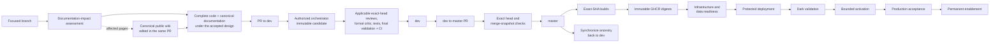

# Release Orchestration

## Release principles

BetStan releases are built around one rule: every review, build, deployment,
activation, and rollback decision must resolve to an exact immutable source
and artifact identity.

Production is never updated directly from a developer worktree, a mutable
image tag, a stale branch name, or an unverified workflow rerun.

## Branch flow

1. Create a focused feature, fix, operations, or documentation branch.
2. Open a pull request to `dev`.
3. Pass the exact-head and merge-snapshot quality gates.
4. Merge the focused change into `dev`.
5. Promote an up-to-date `dev` to `master` through a separate pull request.
6. Synchronize the resulting `master` ancestry back into `dev`.

Direct pushes to `dev` or `master` are not part of the supported flow. Only
`dev` may be promoted to `master`.

### Concurrent feature delivery

Several development sessions may prepare and merge compatible features at the
same time. A production promotion may therefore contain more than one reviewed
feature. The release contract is inclusion-based rather than
session-exclusive:

1. each session records the protected commit or commits required for its
   outcome;
2. the release selects the exact current `master` SHA;
3. every required commit must be an ancestor of that SHA;
4. the complete aggregate SHA receives fresh build, data, rollback, and
   acceptance evidence.

Additional protected commits are not a reason to reset `master`, discard
another session's work, or deploy an older candidate. If `master` advances
during a release chain, the older chain is superseded and the new current
candidate is used when it still contains all required commits.

Development, review, and branch integration can remain concurrent. Production
dispatches, data changes, deployments, activation, rollback, and recovery stay
serialized so two sessions cannot mutate the live system at the same time.

On resume after another session's release, reconcile current protected
`master`, the actual deployed generation, and the exact retained artifacts
before selecting remaining work. Source promotion and deployed state are
different facts. Do not replay an old data, infrastructure, deployment,
activation, or recovery plan from stale notes. Reuse unchanged source reviews
only under [[Agents]]; current runtime and release provenance still need their
own evidence. Respect an explicit pause rather than interpreting resume
notes as authority to continue operations.

## End-to-end release structure

```mermaid
flowchart LR
    Branch["Focused branch"] --> Docs["Documentation-impact assessment"]
    Docs --> Candidate["Complete code + canonical documentation<br/>under the accepted design"]
    Docs -. affected pages .-> Wiki["Canonical public wiki<br/>edited in the same PR"]
    Wiki --> Candidate
    Candidate --> DevPR["PR to dev"]
    DevPR --> Snapshot["Authorized orchestrator<br/>immutable candidate"]
    Snapshot --> DevChecks["Applicable exact-head reviews,<br/>formal critic, tests, final validation + CI"]
    DevChecks --> Dev["dev"]
    Dev --> Promote["dev to master PR"]
    Promote --> MergeChecks["Exact head and<br/>merge-snapshot checks"]
    MergeChecks --> Master["master"]
    Master --> Build["Exact-SHA builds"]
    Build --> Registry["Immutable GHCR digests"]
    Registry --> Infra["Infrastructure and<br/>data readiness"]
    Infra --> Deploy["Protected deployment"]
    Deploy --> Dark["Dark validation"]
    Dark --> Activate["Bounded activation"]
    Activate --> Accept["Production acceptance"]
    Accept --> Commit["Permanent enablement"]
    Master --> Sync["Synchronize ancestry<br/>back to dev"]
```

Documentation-only changes use the same reviewed branch and promotion model.
They do not require a runtime deployment when no runtime artifact changed.

## Pull-request evidence

Every pull request records:

- a short plain-language title that describes the outcome rather than an
  ambiguous category such as `chore`, `misc`, or `wip`;
- why the change exists;
- exact base and head identity;
- scope and explicit exclusions;
- compatibility and migration effects;
- user-facing consistency impact;
- commands and results;
- release and rollback impact;
- unresolved exceptions or remaining work.

Each PR also has public-safe GitHub labels for traceability:

- `session:<slug>` identifies the bounded development session;
- `feature:<slug>` groups the durable product or engineering feature.

The same pair follows implementation, promotion, and ancestry-sync PRs. A
shared promotion can carry several pairs when it aggregates work from multiple
sessions. These labels are informational only: they do not satisfy or change
checks, approvals, merge policy, release authority, deployment, activation, or
rollback. Internal session identifiers, local paths, user identities,
credentials, private runtime references, and production identifiers are never
used as public labels.

Metadata is part of the reviewed evidence. It is completed before the release
critical path rather than repeatedly edited while production work is active.
Title/body edits can start validation. Avoid metadata changes while the
publisher evaluates its snapshot, during a data-to-deploy handoff, or inside
a production-exclusivity window.

Context-label setup reads the PR's labels first. If both informational context
labels are already present, it performs no GitHub mutation. Otherwise it
ensures and adds only the missing labels in one PR edit. An initial read
failure performs no blind mutation and retains the caller's warning or
strict-failure behavior. This prevents avoidable metadata churn; it does not
change managed-label authority or replace the fresh-transition recovery
described in [[Quality Gates]].

## Quality chain

The universal quality gates are:

1. architect;
2. three-model simplifier synthesis;
3. registered implementation owner;
4. validation critic;
5. test engineer;
6. final validator.

The conductor spans the chain but is not a quality gate.
`betstan-ux-ui-expert` is mandatory for every user-facing visual or
interaction change. Other specialists join when their explicit trigger
applies.

Every change records documentation impact. The public-wiki editor is a
supporting unit when public impact is plausible or ambiguous, not a universal
quality gate.

The consolidated design review, single candidate assembly owner, supporting
test evidence, and direct handoffs follow [[Agents]]. They do not add another
release or documentation gate. Source acceptance remains separate from
runtime authorization and the selected procedure's operational checks.

No agent may approve its own implementation, and no agent verdict replaces
GitHub branch protection or protected-environment approval.

## Approval model

Approval is classified by origin:

- Copilot CLI-created and CLI-owned pull requests and protected operations,
  including downstream workflows whose ownership is proven by the canonical
  policy, may use the bounded no-personal-prompt path after every technical,
  lineage, review, and exclusivity check passes;
- a human-originated pull request or protected operation remains personally
  approved;
- neither path can skip required tests, exact-SHA provenance, environment
  controls, genuine wait timers, first-attempt provenance, serialization,
  locks/fences, rollback readiness, or post-deployment validation.

Using a CLI command, sharing an actor identity, carrying a label, or appearing
in a recent-run list does not by itself prove ownership. A technical context
failure or uncertain authority is a blocker, not a request for personal
consent and not permission to adopt human-originated work.

The implementation uses private, one-operation authority records outside the
repository. Their payloads and state transitions are deliberately not
documented on the public wiki.

## Build and registry

- A push to the production branch starts the first-attempt production build.
- Service images are tied to the full source SHA.
- OCI-compatible images are published to public GHCR.
- Deployment references immutable digests.
- Registry validation proves repository linkage, image architecture, source
  provenance, and anonymous pull.
- Retention protects the current, candidate, and rollback generations before
  deleting older images.

When downstream provenance requires attempt one, a failed run remains failed
evidence. The correction creates a fresh exact candidate rather than
retroactively turning a rerun into the original trusted build.

**Common package publication preflight.** Before dispatch preparation and
again at the final pre-dispatch boundary, the dispatcher verifies the actual
protected environment: expected reviewer/self-review configuration and
current CLI reviewer eligibility, disabled administrator bypass, `master`-only
branch selection, and complete, consistent metadata confirming the required
environment secret's presence. Unreadable, missing, malformed, or inconsistent
metadata blocks dispatch. Secret presence is configuration evidence, not
proof of credential validity, package publication rights, or two-factor
authentication readiness. Registry authentication and publish-time checks
remain unchanged, as do exact-SHA/tarball binding and one-use, non-replay
safeguards. Package provenance also requires `repository.url` in
`common/package.json` to match the source repository named in the attestation;
`repository.directory` set to `common` identifies the package within the
monorepo.

## Infrastructure and data handoff

Before deployment, the release chain verifies:

- current infrastructure provenance and capacity;
- explicit, hash-covered upstream run and artifact identities before one-use
  authority, immediately before approval, and before workflow cloud access;
- the protected job's injected runtime mode still equals the dispatch-bound
  mode, with current-`master` checks before and after upstream validation;
- complete paginated artifact inventories, current first-attempt identity, and
  chronological GHCR build -> package validation -> k3s capacity lineage;
- exact bounded artifact contents, including package-validation evidence naming
  the exact build run it inspected and capacity evidence naming its candidate
  and upstream runs;
- current `master` identity;
- image digest availability;
- for k3s, candidate verification, infrastructure finalization,
  authority-bound native CRI preload, and aggregate diagnosis/checkpoint
  creation in that order;
- migration and schema compatibility;
- dry-run results;
- for non-dry-run k3s data maintenance, a root filesystem at or below the
  fixed 70 percent limit before database locking or maintenance begins;
  over-limit nodes stop before data mutation and use the bounded recovery
  described in [[Infrastructure]];
- required backfills and indexes;
- public-write fencing and writer quiescence when data mutation requires it;
- a matching pre-mutation rollback baseline;
- fixed-target data operators whose journal binds the exact preimage, target,
  source SHA, apply state, verification state, and rollback state;
- absence of competing production operations.

**Upstream artifact transport.** The retry contract is limited to the same
authenticated byte-read GET: at most three attempts, each with a
120-second subprocess timeout, and 1/2-second backoffs only before eligible retries.
The 363-second configured allowance excludes process overhead and is not a
whole-validator deadline. Only positively identified HTTP 500/502/503/504,
network timeout/reset, or subprocess timeout is retryable; permanent,
authentication, not-found, cancellation, unknown/ambiguous, content, and
provenance failures remain fail-closed. Failed-attempt bytes are discarded,
successful bytes still undergo existing validation, and diagnostics are fixed
and sanitized. Failure/retry messages retain classification, optional validated
HTTP status, attempt and disposition, and append fixed `request_kind`
(`artifact-zip`, `job-log`, `attempt-log-zip`, or `unrecognized`) and static
`diagnostic` observation fields. Unrecognized or conflicting signatures yield
`unclassified`; no raw diagnostic content is emitted. These fields describe
observations, not proven root causes, and never influence retry decisions.
Classification, permissions, retry eligibility, timeouts, backoff, cancellation
and binding checks are unchanged; successful byte reads remain silent.
These are transport retries, not protected-workflow reruns or
reuse of consumed authority, and do not establish that an unclassified failure
would recover.

Failed-deploy native-input validation uses the exact attempt-one run-log archive
as its single primary byte source instead of a direct job-log request. Native
latest/attempt-one metadata, the complete paginated attempt-one job inventory,
and the exact unique `deploy` or `rollout` job remain authoritative. Archive and
artifact reads share bounded in-memory ZIP validation, retaining path, duplicate,
file-type, symlink, encryption, member-size and expansion checks; no filesystem
extraction or raw-log persistence/output is added. Selection requires exactly one
original root filename formed from an optional minus sign, ASCII digits, `_`,
the validated job name and `.txt`, across normal and legacy forms. There is no
preference, job-ID inference, nested-basename matching or fragment concatenation;
ambiguity fails closed. The selected whole-job bytes feed the unchanged parser.
There is no preliminary job-log request, fallback or extra read; eligible retries
use the same attempt-one archive endpoint. This substitution neither establishes
the original failure's cause nor guarantees future runner success.

**Release disk checkpoint authority.** Registry verification of all ten
immutable candidates is required, but does not establish k3s node CRI
residency. The existing finalization phase therefore finalizes infrastructure
before preloading those public immutable references through the authority-bound
native k3s CRI path, and runs aggregate diagnosis only after preload completes.
Neither registry verification nor successful preload is release authority:
checkpoint creation still requires the aggregate public-state contract, while
later revalidation applies its selected public or held profile. Candidate and
rollback CRI residency, lineage, identity, checksums, and kubelet checks remain
mandatory at their applicable boundaries.

Protected k3s live-data and deployment windows retain the existing target SSH
key and known-host material until their read-only node disk revalidation is
finished. The existing unconditional cleanup removes that material and closes
access, including on failure. API-only callers keep the default early removal
after API forwarding is established. This caller-specific retention leaves
strict SSH checks, bounded sessions, disk thresholds, physical locks, immutable
source/checksum binding, and the normal release and rollback flow unchanged.

Checkpoint creation and each public or held revalidation independently require
fresh kubelet node-filesystem and raw-root byte measurements to satisfy
`usedBytes * 100 <= capacityBytes * 70`. Equality passes; one byte over the
limit withholds eligibility. The separate governed diagnosis path remains
available over the limit. During standalone finalization, candidate-verification
or candidacy-preload failure stops further preload work and removes candidate
and checkpoint evidence, while otherwise-valid finalized infrastructure
provenance remains available for governed diagnosis or reclaim. Authority,
access, infrastructure-finalization, and cleanup failures remain fatal.
[[Infrastructure]] describes the bounded preload behavior.

Journal headroom uses the distinct protected operation
`oci-k3s-disk-reclaim-journal`, fixed category `system-journal`, and empty image
IDs. It retains current-source, first-attempt build/infrastructure/diagnosis
bindings and the existing protected infrastructure environment. Both bound
diagnosis and fresh runtime evidence must prove `/var/log/journal` is a real
directory on the root filesystem and exceeds the fixed retained target of
512 MiB (536870912 bytes). Gross journal bytes smaller than the larger fresh
root/kubelet excess reject before mutation; this proves only impossibility,
never predicted recoverability. Broad log totals or legacy diagnosis lacking
journal evidence cannot grant journal authority.

After fresh validation and planning, the protected operation permits one journal
rotation and one archived-log cleanup limited to that persistent directory.
Deletion of archived persistent journals is irreversible; source or application
rollback cannot restore deleted archives. The retained target does not guarantee
an exact directory size or amount of recovered space. There is no path/size or
environment override, volatile-journal vacuum, retry, generic deletion, APT
cleanup, or CRI fallback. Rotation or cleanup failure skips preload but still
attempts post-runtime/capacity evidence and cannot produce a checkpoint. Journal
finalization requires a measured decrease from both bound and fresh journal
observations, no identity/workload/queue/public-state drift, and both
authoritative post-filesystem byte checks.

Public runtime v3 adds the strict seventh persistent-journal consumer; runtime
v1/v2 retain their six-consumer readers and held runtime v1 is unchanged.
Diagnosis v2, reclaim plan v1, reclaim v1, and checkpoint v1 keep their versions.
Checkpoint `reclaimCategory=system-journal` is valid only under the existing
`READY_RECLAIMED` rules; CRI remains checkpoint-ineligible.

When native APT cleanup or fixed journal mutation succeeds within a governed
first-attempt reclaim, the existing action immediately performs exactly one
service-sorted preload of the bound diagnosis candidate `imageRef` values before post-state capture and
finalization. It reuses the unchanged native, sequential, anonymous
`k3s crictl pull` behavior and exact raw-root 70-percent pre/post admission,
without retry, deletion, pruning, credentials, or an alternate client. Shared
preload logic does not change authority or thresholds.

Non-CRI finalization allows a newly added native CRI image ID only when exact
diagnosis candidate `imageRef` residency proves it uniquely. Any removal or
foreign addition fails, and an added ID receives no exception when residency
is ambiguous. Manifest and platform digests are not CRI image IDs. Status `20`
remains candidacy failure, so post-state and reclaim evidence are preserved and
a valid selected cleanup may still finish `RECLAIMED` and successful, but no
checkpoint is emitted and the reason is `candidate_preload`. A non-`20`
preload failure remains fatal after evidence capture where possible.
Standalone finalization preload and CRI reclaim remain unchanged, and CRI
reclaim cannot create the release checkpoint.

These outcomes do not grant checkpoint authority. Eligibility still
independently requires complete residency for all ten candidates and the
rollback generation, plus every existing byte, identity, lineage, public-state,
workload, queue, and health gate.

Every current live-data operation and normal or recovered deployment binds a
full `checkpoint_source_sha`, positive `disk_checkpoint_run_id`, canonical
checkpoint checksum, and disposition from the exact infrastructure producer.
Fresh phases require the checkpoint source to equal the approved SHA. A resume
may use an ancestor only after the pre-authority and workflow checks prove that
every descendant change is under `.github/`, `infra/`, or Markdown, candidate
images are exactly equivalent, and the original applied source, predecessor,
failed run, build, infrastructure, checkpoint, and data lineage all resolve
recursively. A later phase or deployment rejects any checkpoint source, run,
checksum, or disposition substitution.

Those identities do not all advance together. Build, infrastructure, and disk
checkpoint runs remain bound to the original `checkpoint_source_sha` and are
serialized unchanged into every successor v6 artifact. The current workflow
advances to the approved SHA, while the predecessor-v6, failed deployment, and
failed activation runs bind an explicit hash-covered `resume_source_sha`.
That source may be the approved SHA or the proven GitHub/infra/Markdown-only
ancestor; a newly produced byte-equivalent build or infrastructure run is not
interchangeable with the original.

The deploy consumer uses the validated `CHECKPOINT_SOURCE_SHA` for infrastructure
provenance and the live instance's source tag. Deployment, lock, and release
provenance continue to use the current control `SOURCE_SHA`. Callers that omit
the checkpoint source retain the existing equal-source behavior.

The journal extension adds one fixed cleanup category, its distinct protected
operation, and public runtime v3. It adds no workflow, release phase, threshold
change, credential path, or alternate image client. Because the checked-in
finalization and checkpoint source changed, rollout requires the normal focused
branch-to-`dev` and `dev`-to-`master` promotion followed by a fresh first-attempt
build at the exact current `master` SHA and a new downstream release-evidence
chain; the ancestor-resume allowance above does not authorize reuse for this
change.
Rollback is a separately reviewed forward correction or revert through the
same promotion path and must produce its own fresh exact-current-SHA chain; it
cannot revive removed candidate or checkpoint evidence. Application rollback
must retain control code compatible with runtime v3 and journal checkpoints,
as described in [[Infrastructure]]; evidence must not be relabeled to satisfy
older readers.

When `baseline_recovery_run_id` is nonzero, its hash-covered
`baseline_recovery_source_sha` is also mandatory before authority. The shared
fixed validator accepts only the exact successful cache-recovery or partial
rollback run and its safe, complete, checksum-bound repository artifact. It
recursively resolves the selected build and upstream build run, per-service
manifest and platform identities, first-attempt infrastructure provenance,
cache plan carrier and any distinct failed/cancelled plan origin, or the exact
failed partial-rollback state and Telemetry lineage. Partial recovery restores
only changed services in reverse producer rollout order; forward or otherwise
permuted plans are rejected. Run zero requires source `none`; internally
consistent but externally substituted recovery evidence is insufficient.

The upstream binding language remains declarative: it can select an expected
head SHA, expected `success`, one fixed disk-checkpoint validator, or one of
the three fixed failure-recovery profiles, plus one purpose-specific
successful-held-handoff continuation profile. It cannot carry arbitrary commands,
modules, plugins, or job expressions. Dispatcher, approver, and workflows read
the protected operation environment's authoritative `OCI_RUNTIME_MODE` again
at each prerequisite-decay boundary before intent, claim, or approval.

Failed deployment recovery is classified exactly. Provenance verification uses
step-local default workflow authentication without expanded permissions. The
existing retained-hold profile also admits a narrowly proven pre-runtime
provenance failure with no deployment recovery artifact. Complete authenticated
native run/step, trusted workflow-blob, and dispatch evidence must bind the
original successful v6 handoff, build, infrastructure, checkpoint, and original
before-baseline. That baseline, not candidate images, governs this case:
current ingress fencing, seven-writer quiescence, all ten baseline images, and
baseline-consistent Auth, Client, and Telemetry health/state must be positively
verified. Lease expiry grants no live authority; lock transition requires
snapshot-bound own release and exact released-only acquisition. Ambiguity or
conflict stops with maintenance retained, without generic expired-lock reclaim,
expired-lock renewal, replay, force release, or writer restoration. This is an
additive mode within the existing operation, not a new workflow; existing
schema keys and post-runtime cases remain unchanged. Rollout and rollback
require compatible control readers; older readers reject unsupported lineage
rather than relabeling evidence. A post-runtime retained hold still requires
successful maintenance re-entry and accepts only lock/fence release results
`skipped/skipped`, `failure/skipped`, or `success/failure`; the last case relies
on re-entry having reacquired the exact lock and re-held maintenance. A
released-runtime recovery requires its fixed failed-public-validation and
successful-release profile. Failed activation cleanup requires its fixed
pre-authority run evidence and sanitized acceptance user identity. Its
authority resolves the failed activation to the exact successful deployment
and that deployment's actual v6 handoff. An optional earlier failed deployment
is resolved separately through that handoff's resume authority rather than
being forced onto the successful deployment lineage. Because the successful
deployment released the earlier runtime hold, cleanup acquires a fresh exact
operation lock and then enters maintenance. Under that lock and maintenance
hold it idempotently demotes the exact retained account to `USER`, verifies
exactly one matching account, and removes only draft slips whose `_id`, user,
bet kind, status, board revision, and board fingerprint still match the
inspected documents. A role change, concurrent slip mutation, or cleanup-count
conflict blocks the resumed data phase. No profile widens normal success
authority.

Each fixed profile downloads and parses its exact artifacts; run metadata and
job conclusions alone are insufficient. ZIP paths and members must be safe and
complete, checksum manifests and baseline capture identity must match, and the
complete predecessor-v6, deployment, build, infrastructure, checkpoint, and
activation tuples must resolve without substitution. Post-runtime retained-hold
deployment recovery uses the checksum-sealed intent written before lock renewal
plus the post-rehold failure lineage. Failed-activation cleanup uses a separate
exact recovery-authority artifact rather than treating the workflow's larger
diagnostic evidence directory as that authority.

The single `oci-live-data-continue-held-handoff` operation uses the existing
data workflow, `apply-slip-index` phase and `oci-migration` environment.
Hash-covered `held_handoff_run_id` and `held_handoff_source_sha` identify the
actual successful held owner, separately from the original applied-data and
failed-deployment rollback root. Original root inputs and historical request
hashes retain their meanings; the successor uses corrected current-master
authority. Eligible CLI-owned gates retain existing automatic approval.

Before intent/approval and in workflow preflight, this operation admits only
the reviewed historical producer's missing `resume-images.tsv`. Complete
first-attempt success and held-work proof, safe inventory, full checksum
coverage, provenance, schema, journal, reports and original root evidence remain
mandatory. The recorded image hash must match the independently validated
original build manifest; no historical artifact is reconstructed or made
deployable. Complete bounded history must exclude intervening deployments or
incompatible transitions up to an immutable successor cutoff bound to native
creation/execution evidence. Later legitimate deployment cannot invalidate
that interval; fresh current exclusivity remains mandatory.

Physical admission uses the actual held owner, not the root tuple: a fresh
baseline, verified fence, seven quiescent writers, exact images and supporting
state, held checkpoint and fresh owner/source-bound lock snapshot are required.
Strict snapshot-bound own release and released-only acquisition retain the
same UID and exact released generation, even for an expired lease; expiry
grants no authority. These two compare-and-swap transitions are not atomic.
Partial or ambiguous failure retains maintenance, records confirmed ownership
honestly and permits no blind replay, fallback or false successful handoff.
Success requires real new `apply-slip-index` execution and complete validation
under the successor lock, never skipping work because the prior phase succeeded.

**Final data-handoff baseline admission.** Only `apply-slip-index` adds this
operation-specific check at the actual selected fresh or imported baseline.
Canonical checksum/provenance validation runs first, then retained-Telemetry
eligibility, before baseline digest export, capacity checks, this invocation's
operation lock, or maintenance entry. A retained profile requires exactly one
checksum-bound Telemetry deployment row with desired replicas `1`. A qualified
historical nine-application absent profile retains its existing
positive-absence and provenance requirements.

Normal and recovery-authorized fresh paths and both authorized
maintenance-resume variants use the selected baseline; imports are not
recaptured.
Recovery prevalidation shares the check while retaining the planner's complete
local assertion as defense in depth. Generic capture and validation, ordinary
backfills, dry-run and artifact-only validation remain unchanged, as does the
seven-writer set.

Rejection at this admission check performs no new lock acquisition, transfer,
renewal or release and no runtime restoration; inherited holds stay untouched.
It is not proof that no prior lock exists or that availability was restored.
This is necessary profile compatibility, not universal rollback authority,
proof of data reversibility, or a guarantee of recovery from every failure.
It introduces no automatic scaling, repair, replay, reset or admission bypass.

**Pending fixed Backoffice cleanup.** The protected live-data chain adds one
fixed-boundary Backoffice projection cleanup without creating a separate
production path:

1. `dry-run` performs the existing fixed-reschedule preflight, then the
   Backoffice cleanup preflight, before the compatibility-backfill and Slip
   index preflights;
2. `apply-backfills` completes and verifies the existing fixed reschedule, then
   runs the Backoffice cleanup in preflight mode only;
3. `apply-slip-index` first reverifies the fixed reschedule, completes the
   existing backfill and index work, then runs cleanup preflight, apply, and
   verify. Cleanup apply is the last fenced database mutation.

Production execution is permitted only through the protected workflow at the
exact current `master` SHA. Every phase stops if the existing reschedule is not
safely applied, completed, or resumable; the cleanup cannot skip or replace
that prerequisite. No production workflow has been dispatched for this
change.

Mutating phases quiesce the seven writers: Backoffice, Bet, Event, Gamemaster,
Moderation, Resulting, and Slip. Backoffice quiesces first so its projection
cannot race the cleanup and restores last. Auth and Client remain served as
readers, while `/api/backoffice` is expected to return fenced `503` responses
during mutation. The final phase retains the established write fence and
database-lock handoff for deployment.

Once `apply-slip-index` has entered maintenance, that safety boundary remains
in place regardless of how the phase ends. Success transfers it to deployment;
failure, cancellation, or handoff-evidence failure re-establishes seven-writer
quiescence and retains the shared database lock instead of restoring the prior
runtime. Recovery at the same exact source can re-enter and verify an
already-applied cleanup without expanding its fixed target set. A retained
hold is a safe unavailable state, not evidence that production execution
occurred or authority to begin another operation.

New sanitized evidence uses `live-betting-v6`. It preserves the v5 cleanup
contract and adds the four bound checkpoint fields:
`checkpoint_source_sha`, `disk_checkpoint_run_id`,
`disk_checkpoint_sha256`, and `disk_checkpoint_disposition`. Provenance,
journal, final schema, resume authority, deployment provenance, and activation
lineage carry those values unchanged. The verifier keeps the literal
historical meanings and exact key sets of `live-betting-v1` through `v5`, but
those generations are inspection and rollback evidence only; current
successors and deployments require v6. The cleanup command still has no
rollback phase, so release rollback continues to use the protected baseline,
fence, lock, and recovery model described below.

Successful-held-handoff successors emit `live-betting-data-resume-v3` alongside
v6 evidence, distinguishing the original root, previous held owner and new
successor. `held_handoff_evidence_sha256` binds the actual prior checksum-manifest
bytes; ownership-transition and cutoff evidence join the new checksummed bundle.
The producer copies the actual validated `IMAGE_PROVENANCE_FILE` bytes into
`resume-images.tsv`, verifies their authority-bound hash and includes the file
in `SHA256SUMS`. Normal deployment accepts only the new complete artifact and
successor holder; existing v1/v2 semantics and strict missing-file rejection
remain unchanged. Promote compatible v3 readers and writer together. After v3
emission, rollback must retain v3, all historical profiles and endpoint-local
chronology or use reviewed forward correction, never rewrite old proof.
Frozen retirement profiles are not extended for this continuation.

Fresh and released-runtime data paths complete static, checkpoint, predecessor,
baseline, and read-only access validation, then perform a fresh public
checkpoint revalidation as the final read-only action immediately before
acquiring the lock or entering maintenance; no capture or other operation may
intervene. A retained
hold first validates its exact recovery profile, verifies the inherited hold
read-only, and completes a stable held checkpoint revalidation before any new
lock action. There is no post-data held checkpoint check and no new
failed-final-data state.

Held collection is stable-only: raw bytes, root/Mongo mount and node/runtime
identity, and immutable candidate/rollback residency. It performs no HTTP,
RabbitMQ/rabbitmqctl, queue, pod, Deployment, or mutable workload-health
query, so deliberate application quiescence does not invalidate the snapshot.
Public revalidation additionally derives rollback residency from the fresh
Deployment image generation; a different valid resident generation is drift.
Held revalidation instead uses the sealed rollback list because Deployment
inspection is forbidden.

Deployment validates policy, build, infrastructure, final-v6, checkpoint, and
recovery bindings before read-only runtime access. It then verifies the exact
maintenance fence and transferred lock, validates the rollback baseline,
revalidates the held checkpoint, and renews that exact lock without an initial
acquire fallback. Only then may it deploy and run protected health. A second
fresh held revalidation repeats exact byte, mount, candidate, and rollback
checks before release; one byte above 70 percent blocks release. The lock is
released before the fence. Existing failure handling may re-establish the hold
and reacquire the exact lock only on its bounded post-failure path.

If an already-dispatched but unissued operation loses a prerequisite, its
exact request and run remain serialized until bounded, reviewed recovery proves
the exact source identity safe to retire. Ambiguity, partial execution, or
provenance drift remains a blocker. Recovery preserves one-use authority
evidence and cannot grant new dispatch, approval, or mutation authority or
bypass protected approval.

Repository-global exclusivity prevents incomplete evidence from being silently
replaced while active production work remains fenced. Before provider mutation,
the active job revalidates the exact source, runtime mode, upstream provenance,
approval authority, and exclusivity. Any failure stops before mutation without
weakening the protected evidence.

Two frozen, policy-resolved workflows -- the live-data handoff and live-betting
activation -- share one narrowly allowlisted transition proof for disabled
history that is fully unmaterialized. Only these two workflows can ever become
candidates through this path; every other workflow and operation keeps its
default classification and blocking rules unchanged. Before external
enablement, the dispatcher seals the complete evidence-derived candidate set
for the request's own resolved workflow in a repository-global prepared intent
that blocks every competing protected request. After enablement it re-collects
the complete production inventory twice, requires the same workflow identity
and evidence with no other active work, and atomically crosses into the
existing ambiguous dispatch state immediately before the provider call. The
transition never names, excludes, cancels, or deletes historical runs, and it
does not weaken the default rule that active work on either workflow blocks.
A prepared intent may be discarded only while its own workflow remains
disabled; after the dispatch boundary, exact capture recovery is required, and
issued or consumed authority remains one-use. If the exact bound run is
subsequently validated as terminal and jobless and its authority is retired, a
fresh preparation may create a new generation for the same request. For only
these two workflows,
`copilot-cli-dispatch-stan.sh <request-file> --retire-zero-execution` derives
that run ID from the exact bound preparation and cannot select another run. It
may retire consumed authority only when the retained same-run approval is
valid, no approval is in flight, and all preserved request, source, and
workflow evidence still agrees, historical control remains valid, and the
immutable workflow is first-attempt-only. Two canonically identical, complete
terminal observations must show that every attempt performed zero execution:
attempt one was non-successful, later attempts were skipped, no runner or steps
were assigned, and no artifacts or pending approval gates exist. Immediate
version and control revalidation may then write only the strict v4
`approved-zero-execution` retirement variant. Existing v1/v2/v3,
claimed/jobless, and prerequisite-rejection semantics remain unchanged.

A distinct v5 `preflight-read-only-failure` retirement covers only an owned,
terminal failed first attempt of `oci-live-data-resume-deploy` at the reviewed
read-only preflight, before any production step executes. It uses the existing
live-data rollout workflow, not a new workflow or protected operation. Unlike
v4, an assigned runner and executed preflight steps are expected; v4's empty
steps and no-assigned-runner requirements remain unchanged. Admission binds
the complete 39-entry native step sequence and the historical/current workflow
and executed dependency closure to a frozen reviewed profile. Two independently
collected, complete authenticated observations must be canonically identical
across collection rounds and prove the exact attempt and single assigned-runner
job, with no later attempt, artifacts or pending deployments, and complete native
approval history matched to preserved same-run receipts. Within each observation,
latest-run and exact-attempt responses must agree on immutable identity and
creation/run-start times. Their update times need not match, but each endpoint
must retain creation ≤ run start ≤ update, with the entire job interval inside
that endpoint's run-start-to-update window. No tolerance or wider combined window
is used. Both raw responses remain preserved without normalization in the
evidence and its digests.
Successful upload steps alone do not prove an empty artifact inventory.
Fresh source, disabled-workflow, exclusivity, native-evidence and generation
checks precede the existing locked compare-and-swap transition; incomplete
evidence, ambiguity or drift stays fenced. The original request, capture,
consumed record and approval receipts remain preserved. This adds no transport
retry and makes no claim about the original failure's cause.

Retirement changes only local authority state and adds immutable proof,
preserving the original request, receipt, run identity, first-attempt identity,
capture, seal, and intent. It performs no cancellation, rerun, approval,
enablement, dispatch, provider, or data operation, creates no run or replacement
authority, and neither releases production locks nor changes the runtime hold.
A later explicit normal preparation archives the spent generation before
replacing the same prepared slot and validates current prerequisites;
preparation itself creates no run or approval. A subsequent normal dispatch
receives a distinct run ID at executable attempt one, fresh one-use authority,
and a new approval receipt under all normal gates, with no silent cancellation
override or inherited approval. V5-capable readers retain unchanged v1-v4
support, and new ordinary authority records remain v1; older readers reject v5.

The original nine-blob closure profile and its diagnostic-reader variant are
retained, with one exact archive-reader profile differing only in the reader
blob. Historical and current closure
sides, including local and authenticated remote values, must match the same
complete profile; mixed, incomplete or unknown profiles are rejected. New
retirement context, collection and writing admit only the archive profile.
Stored v5 loading accepts all three complete profiles and retains endpoint-local
chronology without rewriting records, digests or history; schema and evidence
shape are unchanged. Promote the archive reader and compatible authority
reader/writer together, only after protected promotion of endpoint-local
chronology support and completed, persisted canonical retirement of the bound
predecessor generation under its matching profile. No mixed-profile exception
can replace this ordering.
Rollback must retain endpoint-local chronology and every actually emitted
profile, including the archive profile after its first emission; v5 schema
support alone is insufficient. Use a reviewed forward correction if these
capabilities cannot be retained,
never an old-only downgrade, timestamp rewriting, record relabeling or deletion
of spent history.

Per-request one-use rules and repository-global active, inflight,
and exclusivity boundaries remain distinct and unchanged; the spent generation
stays preserved and cannot be reopened or replayed, and the two target
workflows can never consume or reuse each other's requests, observations,
seals, or prepared context.

The final data phase hands its lock and maintenance state directly to the
matching deployment. That prevents an application rollout from racing a
schema, index, rollback, or recovery operation.

## Deployment

Deployment proceeds in dependency-safe order:

1. make shared data services ready, roll out Telemetry, and apply its canonical
   and diagnostic API routes before instrumented Client traffic;
2. roll out the remaining services sequentially in the checked-in deployment
   order;
3. verify each live workload is ready and running its expected digest before
   continuing;
4. deploy Gamemaster last so event production starts only after its consumers
   are healthy;
5. validate routes, TLS, response shapes, SSE, storage, queues, consumers, and
   restart state.

A successful deployment command is not the release conclusion. Protected and
public validation must both pass.

### Compatibility-first producer changes

When a producer begins persisting or publishing a new additive enum value, the
immediately previous production generation must already understand that value.
Use two immutable releases:

1. deploy a compatibility baseline in which consumers, persistence schemas,
   clients, and the producer's replay and manual-recovery paths accept the new
   value, while generation remains on the old engine;
2. capture and validate that compatibility baseline as the rollback source;
3. deploy the producer activation that starts creating the new value.

Do not activate the producer change with a pre-compatibility rollback image.
The rollback target for that activation is the compatibility baseline, so
persisted transitions and historical rows remain readable after rollback.

### Cash-back rollout

Cash-back requires two separate immutable production releases:

1. **B, compatible/OFF:** deploy the compatible runtime with
   `CASH_BACK_ENABLED` explicitly `"false"` in both Bet and Resulting manifests.
   Validate this generation before capturing it as the activation baseline.
2. **A, enabled:** a later reviewed release changes both checked-in declarations
   to `"true"` and passes protected active-mode acceptance against that exact
   source. A pre-cash-back generation is not its compatible rollback target.

Each facade/coordinator latches the flag at startup. Only literal `"true"`
enables admission; missing or `"false"` means off, and invalid values stay
disabled with a sanitized diagnostic. This is not a hot-switch control.
Off mode refuses new quotes and first confirmations with HTTP `503`
`AUTHORITY_UNAVAILABLE` after identity/conflict and existing-operation checks.
Exact pending/terminal retries, readers, listeners, source acknowledgements,
receipt/history publication, release, archive recovery, and ordinary
remaining-stake settlement stay active. Resulting canonically rejects its own
`UNDECIDED` slot with `AUTHORITY_UNAVAILABLE` before further reservation; its
acceptance CAS also requires the latched enabled value. Off mode never
substitutes a history-only rejection or autonomous hold expiry for a canonical
decision.

Both releases retain the full HTTP write fence, zero-pod seven-writer
maintenance, shared operation lock, and Gamemaster-last startup order. Bet may
start before Resulting; public admission reopens last. An enabled Resulting can
process durable broker work while HTTP is fenced, so A's validated B baseline
and healthy shared-clock evidence must precede Resulting startup, not merely
public unfencing.

The existing deployment/readiness path takes three MongoDB `hello` clock
observations with 250 ms pauses, bracketed by local-process wall and monotonic
time. It requires measured query round trips at most 500 ms and wall-clock
consistency within 50 ms; one 30-second watchdog bounds the whole probe.
Evidence binds the source/run and hashed pod, node, container, and Mongo
process identities. Missing, malformed, backward, changed-identity, or timed-out
observations fail closed. The check runs before Resulting starts and through
shared OCI readiness before unfencing, activation, and final validation. It
proves consistency only within the observed window, not UTC/NTP accuracy,
physical commit time, perpetual monotonicity, or behavior between samples or
after the probe.

The cash-back-compatible queue catalog contains **28 queues**: 22 existing
static queues, five cash-back queues, and one pod-scoped Event fanout queue.
Readiness verifies names and consumers for every queue, not count alone.
Only the current catalog permits the known Event dynamic prefix; authenticated
historical baselines retain their exact captured names and count. Health uses
the verified generation/baseline inventory, without queue deletion or a
count override to make a mismatch pass.

## Activation

User-facing live behavior is activated separately from image deployment.

1. Enable the feature under a bounded lease.
2. Run the full browser and API acceptance journey.
3. Create and complete synthetic events.
4. Place and settle separate live and pre-match bets.
5. Check moderation, SSE, history, Backoffice, queues, workloads, and logs.
6. Permanently commit activation only after all evidence passes.
7. On failure, disable the feature and restore the known safe state.

This separates "the code is deployed" from "the feature is safe to expose."

Cash-back acceptance checks both source declarations against live Bet and
Resulting deployments and serving pods. B must explicitly refuse new admission,
keep history readable, and preserve ordinary placement/settlement; it does not
seed a `CASH_BACK` record merely to prove baseline compatibility. Exact-candidate
build and native off-mode recovery evidence establish its compatible recovery
capability separately.

A adds owned live full closure, UI-confirmed pre-match full closure and reload,
repeated partials followed by normal remainder `WIN`, and full-closure
immutability after results. A separate owned pending confirmation must recover
across a protected zero-worker interval using the same Resulting source and
template, immutable image, and replica count. Before pausing, a persisted,
read-back-verified handoff binds the exact protected execution and workload to
its physical-lock generation; private evidence must agree. Identity,
resource-version, and expected-handoff checks govern phase changes, with
bounded readback for ambiguous writes. The shared recovery routine rechecks
ownership and the clock before restoring non-overlapping replacement workers.
Early always-run workflow cleanup invokes that same routine after an arming or
journey attempt, including failure, a killed acceptance process, or cancellation
when the cleanup step can execute.

Owned restoration failures use the existing maintenance hold and positive
verification of the HTTP fence, all seven writers at zero pods, and the retained
lock. Unknown, foreign, or expired ownership authorizes no further workload
mutation; expired own leases are not automatically reclaimed. Persisted release
intent and the exact released generation reconcile a lost release response
without re-quiescing restored writers. Every activation, including compatibility
mode, uses this handoff to persist and read back owner/source/workload-bound
abort authority before live kickoffs, while current-source and readiness
admission are valid. Both failure-disable paths require successful arming and
fresh ownership, not renewed current-`master` admission or Resulting readiness.
Abort-only cleanup does not restart workers, so compatibility/no-interruption
failures can still stop new kickoffs. Reacquisition of the exact own released
lineage tests the observed released state, lock identity, and generation inside
the canonical CAS, leaving intervening or expired foreign owners untouched.
Existing generic lock commands retain their semantics.
Total runner loss can prevent cleanup: the durable handoff
is evidence, not an autonomous executor, and unreadable ownership cannot
guarantee fencing. This is neither a public restart facility nor
failed-deployment recovery authority.

Replaying the same operation must yield one canonical
`ACCEPTED` receipt or `QUOTE_EXPIRED` rejection, with no principal reset or
duplicate closure. Terminal history, outcome delivery, source release, and Bet
projection must demonstrably drain and agree. Existing unexpected-restart and
error checks remain in force. An allowlisted HTTP `400` stale-selection rejection
is recorded as handled only when native browser network-request identity and a
unique method/URL/body fingerprint bind it to the exact request consumed by the
existing retry helper. Missing or ambiguous attribution, unhandled HTTP failures,
and application console errors still block acceptance; retries are not broadened.
Before terminal assertions, `browser-errors.json` retains bounded sanitized
attribution: method/path/status, a fixed allowed reason for handled rejections,
and error source where relevant. It excludes bodies, query strings, raw console
text, credentials, and private identifiers. Exact-head revalidation checks the
complete cash-back evidence before accepted-lease recording and final
activation commit, under the existing evidence-hash authority.

## Rollback and recovery

Every production deployment captures the exact previous application generation
before mutation.

A rollback requires:

- an exact historical source and image set;
- a matching baseline artifact;
- compatibility with the current database and message state;
- healthy queues, consumers, storage, and workloads;
- a defined write-fence or drain when the old version cannot process new
  pending work;
- post-rollback digest and application validation.

The fixed cleanup adds a separate fail-closed rollback compatibility decision.
A well-formed authoritative result proving that its journal is absent leaves
the existing rollback gates in force. A prepared journal blocks rollback and
requires recovery by its exact source. An applied journal permits only an
exact rollback target whose Backoffice listener acknowledges valid pre-cutoff
deliveries before any projection write. Missing required, unreadable,
malformed, duplicate, or unknown evidence blocks rather than being treated as
absence.

Ordinary and maintenance-aware rollback independently bind that exact-target
capability before workload mutation. A Backoffice generation from before the
listener guard is therefore not restorable after the cleanup is applied: a
queued or delayed valid pre-cutoff `NEW_EVENT` delivery must not recreate a
deleted projection. Pending-publication replay-or-drain compatibility remains
a separate mandatory decision; satisfying either the cleanup or publication
decision cannot satisfy the other.

Current ten-application baselines must bind the complete authenticated image
inventory to matching live-image and deployment inventories, including matching
checksum-bound retained Telemetry state. New ordinary historical
nine-application captures must positively prove Telemetry absent; archived
legacy baselines retain the existing reconstruction of provenance from their
exact deployment. The explicitly authenticated split-recovery form remains
distinct: a nine-application image manifest plus separately bound retained
Telemetry, not a rewritten ten-image manifest. Service count, observed presence,
and retention mode alone are not authority. Missing, unreadable, or
contradictory evidence fails closed; recomputing local checksums cannot
downgrade an authenticated ten-application baseline to a historical one.

Historical pre-Telemetry rollback restores only the nine historical
application images and rejects ten-application baselines before mutation.
During that transition, the retained observer must keep
serving a well-formed summary, while its intentionally coarse service states
may be green, yellow, or red as older workloads start. Once all nine historical
applications are exact and ready, terminal rollback removes the Telemetry API
routes, Service, and Deployment. Its durable queue, logical database, and
records remain; no historical Telemetry image is invented.

If a rollback fails after partial mutation, recovery restores the exact
pre-run ten-application state, including the Telemetry image and public routes,
and keeps writes fenced until health is proven. Data restore is used only when
application rollback is insufficient and separately justified.

An incomplete deployment that re-enters maintenance leaves production
deliberately fenced: writers are quiesced, mutating requests are refused, and
the transferred database lock is retained. That state is safe, but ordinary
rollback readiness requires a healthy steady state, so the last known-good
generation would otherwise be unreachable exactly when it is needed. A
maintenance-aware rollback closes that gap. It never waives a check and is not
a skip or force switch: it asserts the expected fenced state positively, and is
usable only when bound to the exact incomplete deployment, its immutable
baseline, the exact deployed generation, and the exact rollback target. It
restores the baseline digests and replica counts, proves the previously failing
workload is stable, releases the database lock and then the write fence in that
order, and finally requires ordinary steady-state readiness. Any failure
re-holds maintenance and reports the true lock state.

Recovery from a ten-application baseline is limited to this eligible
failed-deployment, maintenance-fenced path. For retained Telemetry, this path
supports only a single-replica baseline and rejects unsupported replica counts
before workload mutation. Complete input validation precedes the existing
nine-application restore and separate Telemetry restore, with the same locks,
fences, failure re-hold, and readiness checks. This does not enable
ordinary unfenced rollback after a successful ten-application deployment.
Data-preparation and deployment gates validate baseline evidence; they do not
establish ordinary rollback capability.

Cash-back configuration is part of that same eligible failed-deployment
recovery, not an image-only restore. Baseline capture verifies both Bet and
Resulting deployment and serving-pod flags against the authenticated source.
Recovery resolves the two flags from that immutable source, restores their
literal values (or removes them when the source declares none) while maintenance
and the lock are held with writers at zero pods, and verifies replacement pods
before release. Missing manifests, duplicate, indirect, malformed, or
source-mismatched declarations fail closed. Existing baseline state, checksum,
source, and image formats are unchanged. This does not make ordinary or partial
nine-application rollback eligible for the cash-back generation, or authorize
rollback of a successfully completed A release. When eligibility is not proven,
retain maintenance and report the technical boundary to the release owner.

Mongo maintenance resumes the ingress controller only after exact version,
compatibility-version, and image verification, before applying the Telemetry
ingress. This restores admission readiness without thawing application writers;
deployment failure recovery remains armed until deployment completes. Fenced
rollback also recognizes the deployment cleanup's exact candidate Auth and
Client images over an ordered candidate-prefix/baseline-suffix writer rollout.
It does not accept arbitrary mixed generations: immutable image evidence,
seven-writer quiescence, the write fence, Telemetry resource and route
constraints, and lock ownership remain mandatory. No database restore is added.

When applied-data recovery resumes from that retained hold, each quiesced
writer may use either its exact failed-deployment candidate image or its own
checksum-bound pre-deployment baseline image, allowing a partially completed
sequential rollout to continue safely. Auth and Client remain on their exact
candidate images, while released-runtime recovery requires all nine candidate
images. Baseline provenance, ancestry, quiescence, readiness, locks, fences,
and every pre-mutation check remain fail-closed.

A generation that failed its own deployment is never an accepted rollback
baseline.

## Stall and incident handling

The conductor monitors the real blocking object: agent result, process,
GitHub job, protected approval, handoff, or runtime health signal.

Keep one operation owner and one observer for each owned release chain.
Retain exact owned runs in the existing durable work-unit evidence across
resume; a recent-run list is discovery, not ownership or a reason to forget a
known run. Reconcile the exact run and its proven downstream work after each
job or approval transition, even when the top-level status is unchanged.

- **ACT:** an exact CLI-owned gate is eligible. The conductor immediately
  routes the authorized orchestrator to the canonical approval path, even if
  a timer also exists; the timer remains effective.
- **WAIT:** exact evidence proves an already-approved timer or provider wait.
  Retain bounded observation without submitting a duplicate approval.
- **BLOCK:** invalid local context, missing required proof, unresolved
  authority, source/ownership drift, or unknown evidence prevents safe action.
  State the technical reason. Human-originated operations retain their own
  personal approval path.

These are caller actions, not a new authority framework or critic queue.
Captured dispatch or issued authority is not proof that jobs and the expected
gate have materialized. Approval submission and an intermediate green job
are not terminal release evidence.

- A running watcher is notification transport, not proof of progress.
- A waiting state is classified immediately rather than left to a watcher.
- Approval eligibility comes from the machine-readable protected-operation
  policy and exact durable authority, never an agent's remembered workflow
  category; the conductor routes an eligible CLI-issued gate to the authorized
  orchestrator in the same checkpoint. The conductor does not submit approval.
- One missed checkpoint triggers bounded recovery.
- Two missed checkpoints require a concrete safe action or an explicit
  blocker.
- Failed or missing first-attempt provenance is never repaired with an empty
  commit or an unsafe bypass.
- A terminal workflow that leaves a write fence, operation lock, unavailable
  ingress, or unhealthy workload is an active production incident.
- A proven repository-policy false block is corrected narrowly, with focused
  regression coverage, through the normal branch path.

Routine routing, acknowledgements, timers, and obvious scope corrections stay
with the conductor. Advisory drift or delay blocks only affected dependants;
it cannot freeze independently authorized eligible approval, safe completion,
or incident recovery. Required technical proof still gates its operation.
Use the bounded checkpoints and original correction budgets in [[Agents]],
not a new review round for every status change. Preserve compatibility and
spent authority evidence through any reviewed correction or rollback.

## Documentation impact and public-wiki support

Every change records a documentation-impact assessment. Register the
public-wiki editor when impact is plausible or ambiguous. A clearly no-impact
change instead records the inspected exact-diff paths and its justification.
Product behavior, architecture, contracts, data lifecycle, security,
infrastructure, quality gates, release behavior, UI/UX, and agent-role changes
update their canonical `docs/wiki/` pages in the same pull request before
formal critic review of the immutable candidate and final validation. The
editor returns its owned pages and evidence to the implementation owner
assembling the candidate; the authorized orchestrator creates its immutable
snapshot.

After the exact protected commit merges, the authorized orchestrator, not the
public-wiki editor, publishes changed canonical pages to the GitHub wiki.
Bind publication to that merged commit, not a mutable branch or local
worktree. Verify byte-for-byte equality of `docs/wiki/*.md` with the published
counterparts, including unchanged pages that need no rewrite. Do not reformat
content or make wiki-only policy corrections.

Verify published navigation, links, heading anchors, and rendered diagrams.
Record the source commit, wiki revision, page set, and verification outcome;
a mismatch or broken publication returns to its owner and is not complete.
Matching reusable-agent guidance, PR/release evidence, and explicit accepted
exceptions remain part of the handoff when applicable. Local documentation
readiness is neither final candidate acceptance nor a claim of publication.

Private runtime identifiers, credentials, approval records, and emergency
procedures remain outside the public wiki.

## Related pages

- [[Quality Gates]]
- [[Agents]]
- [[Infrastructure]]
- [[Security]]
- [[Engineering Learnings]]
